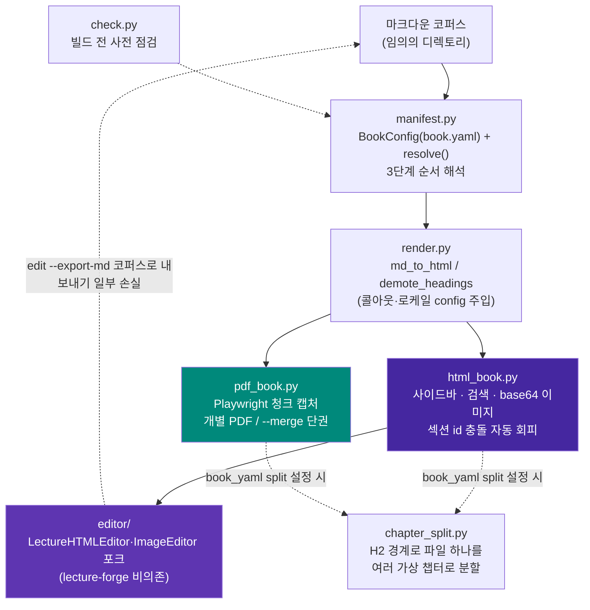

# MDBook-binder

[](https://pypi.org/project/mdbook-binder/)
[](LICENSE)

**임의의 마크다운 코퍼스를 검색 가능한 단일 HTML 도서와 PDF(단권/병합)로 변환하고,
결과 HTML을 편집하는 범용 애플리케이션.**

---

## 목차

- [1. 프로젝트 개요](#1-프로젝트-개요)
  - [무엇인가](#무엇인가)
  - [아키텍처](#아키텍처)
  - [설계 원칙](#설계-원칙)
  - [파일 구조](#파일-구조)
- [2. 핵심 기능 및 사용법](#2-핵심-기능-및-사용법)
  - [순서 해석 — 3단계 우선순위](#순서-해석--3단계-우선순위)
  - [book.yaml 설정](#bookyaml-설정)
  - [마크다운 저작 규칙](#마크다운-저작-규칙)
  - [AI로 챕터 저작하기 — Skill/프롬프트 활용](#ai로-챕터-저작하기--skill프롬프트-활용)
  - [빌드 전 사전 점검 — check](#빌드-전-사전-점검--check)
  - [HTML 도서 빌드](#html-도서-빌드)
  - [PDF 빌드 — 개별/병합](#pdf-빌드--개별병합)
  - [HTML 편집](#html-편집)
  - [PDF 임포트 — import](#pdf-임포트--import)
  - [import 결과물을 챕터별로 분리하기 — 사이드바 챕터 링크 만들기](#import-결과물을-챕터별로-분리하기--사이드바-챕터-링크-만들기)
  - [로컬 LLM 번역 — translate](#로컬-llm-번역--translate)
  - [k2e 번역 완전성 검증 — 잔여 한글 자동 재시도](#k2e-번역-완전성-검증--잔여-한글-자동-재시도)
- [3. 설치 가이드](#3-설치-가이드)
- [알려진 한계](#알려진-한계)
- [변경이력](#변경이력)
- [라이선스](#라이선스)

---

## 1. 프로젝트 개요

### 무엇인가

MDBook-binder는 **임의의 마크다운 파일 모음(코퍼스)을 입력으로 받아, 코드
수정 없이 다음 세 가지를 만들어내는 독립 실행형 CLI 애플리케이션**이다.

1. **검색 가능한 단일 HTML 도서** — 사이드바 목차, 인페이지 전문 검색을
   갖추고, 이미지는 base64로 인라인 임베드되어 파일 하나만으로 열린다.
   Mermaid 다이어그램도 가능하면 빌드 시점에 정적 SVG로 사전 렌더링해
   같이 임베드한다(오프라인 제약은 [알려진 한계](#알려진-한계) 참고).
2. **PDF 도서** — 챕터별 개별 PDF 또는 한 권으로 병합(merge)한 PDF.
3. **HTML 도서 편집기** — 생성된 HTML 도서를 브라우저에서 섹션 단위로 다시
   열어 마크다운·이미지를 편집할 수 있는 웹 편집기.

코퍼스가 아직 없다면 영문 PDF에서 시작할 수도 있다: `import`로 PDF를
마크다운 코퍼스로 추출하고, `translate`로 로컬 Ollama LLM을 이용해 토큰
비용 없이 한국어로 번역한 뒤, 위 세 가지 명령으로 바로 이어받는다([PDF
임포트](#pdf-임포트--import), [번역](#로컬-llm-번역--translate) 참고).

코퍼스가 `book.yaml`로 순서·제목·콜아웃 마커 등을 명시하면 그대로 따르고,
없으면 파일/디렉토리 명명 규칙이나 디렉토리 트리 자연정렬로 순서를 자동
추론한다 — 그래서 새 마크다운 파일이 추가되어도 코드나 설정을 건드릴 필요가
없다.

### 아키텍처



`html_book.py`가 출력하는 `<section class="chapter-section" id="{slug}">`
구조는 `editor/`가 의존하는 **유일한 불변 계약**이다 — 다른 무엇을 바꾸더라도
이 마크업 계약은 유지해야 편집기가 섹션을 인식한다.

### 설계 원칙

1. **순서 해석은 3단계 우선순위**로 자동 결정된다 — 코드 수정 없이 새
   마크다운 파일이 반영되도록 하는 것이 핵심 목표다.
   1. 명시적 `book.yaml`(`order.manifest` 또는 `order.files`)
   2. `book.yaml`이 없어도 루트에 ` ```toc ` 펜스 매니페스트가 있으면 자동
      채택
   3. `Part_<로마숫자>_.../Chapter_<NN>_...` 명명 규칙 감지
   4. 위 전부 실패 시 디렉토리 트리 전체를 자연정렬(natural sort)해 전부
      포함 — "새 파일이 조용히 누락되는 일"을 구조적으로 없애는 최종 폴백
2. **책마다 다른 값(제목/저자/언어/제외 패턴/콜아웃 마커/커스텀 CSS)은 전부
   `book.yaml`로 외부화** — 렌더링 엔진(`render.py`) 코드는 어떤 코퍼스에도
   수정 없이 동작해야 한다.
3. **섹션 ID는 기본적으로 H1/파일명 slug 자동 생성**, 충돌 시 자동으로
   `-2`/`-3` 접미사를 붙인다 — 수작업 매핑 테이블은 "예쁜 URL을 원할 때만
   쓰는 선택적 오버라이드"로 격하한다.
4. **편집기는 lecture-forge에 비의존** — `Lecture_forge`의
   `LectureHTMLEditor`/`ImageEditor`를 포크하되 벡터스토어 기반 이미지 추천
   등 강의 특화 기능은 제외했다.

### 파일 구조

```
MDBook-binder/
├── pyproject.toml
├── LICENSE
├── README.md
├── src/mdbook_binder/
│   ├── manifest.py           # BookConfig(book.yaml) + resolve()/resolve_verbose()/resolve_split_targets()
│   ├── chapter_split.py      # book.yaml split 설정 시 H2 경계로 파일 하나를 여러 가상 챕터로 분할
│   ├── render.py             # md_to_html / demote_headings / 콜아웃·로케일
│   ├── html_book.py          # HTML 도서 빌더 (사이드바/검색/base64 이미지/가상 분할)
│   ├── imgembed.py           # 이미지 → base64 data URI 인코딩 공용 유틸
│   ├── mermaid_prerender.py  # Mermaid 빌드 타임 정적 SVG 사전 렌더링 (Playwright)
│   ├── mermaid_wrap.py       # Mermaid 노드/엣지 라벨 자동 줄바꿈
│   ├── theme.py              # --color 색상 테마 프리셋 (사이드바/제목 강조색)
│   ├── pdf_book.py           # PDF 빌더 (청크 캡처 + 개별/병합)
│   ├── pdf_import.py         # PDF → 마크다운 코퍼스 추출 (컬럼/표/이미지 인식)
│   ├── translation.py        # 로컬 Ollama 번역 (청크 분할, 코드/mermaid 보존)
│   ├── check.py              # 빌드 전 사전 점검
│   ├── cli.py                # mdbook-binder CLI (check/build/edit/import/translate)
│   ├── editor/                # Lecture_forge 포크 — lecture-forge 비의존
│   │   ├── html_editor.py      # BookHTMLEditor — 섹션 CRUD, 이미지 추가(base64 임베드), 마크다운 코퍼스 역방향 내보내기
│   │   ├── image_editor.py     # 이미지/다이어그램 편집, 이미지 교체(base64 임베드)
│   │   └── server.py           # Flask 편집 API 서버
│   └── templates/
│       ├── html_book.css/js    # HTML 도서 사이드바·검색·mermaid
│       ├── pdf_override.css    # PDF 전용 레이아웃 오버라이드(CSS)
│       ├── pdf_book.js         # PDF 렌더링 보정(Mermaid 크기 측정·청크 분할)
│       ├── vendor/              # 번들: mermaid.min.js·Noto Sans KR 폰트·Tailwind·EasyMDE·Font Awesome·marked.js(오프라인용)
│       └── editor/              # 편집 SPA (index.html/editor.css/editor.js)
└── tests/
    ├── test_cli.py               # CLI 옵션 배선·에러 메시지 (17건)
    ├── test_manifest.py          # 3단계 순서 해석 + split 설정 파싱/해석 (20건)
    ├── test_chapter_split.py     # H2 경계 탐지·분할(펜스/raw HTML/blockquote 보호) (9건)
    ├── test_html_book.py         # 섹션 id 충돌 회피·이미지 임베드·챕터 간 링크 재작성·가상 분할 (18건)
    ├── test_check.py             # 사전 점검 + 설치 환경 점검 (14건)
    ├── test_editor.py            # 이미지 추가/교체 후 base64 임베드 + 코퍼스 역방향 내보내기 + 저장 왕복 충실도 (14건)
    ├── test_mermaid_prerender.py # Mermaid 사전 렌더링 성공/폴백 (6건)
    ├── test_mermaid_wrap.py      # 라벨 자동 줄바꿈 (12건)
    ├── test_theme.py             # 색상 테마 프리셋 + book.yaml/--color 연동 (8건)
    ├── test_pdf_book.py          # PDF 페이지 경계 계산 순수 함수 + 페이지 HTML 템플릿 (23건)
    ├── test_pdf_import.py        # 컬럼/표/불릿/이미지 추출 + 폰트 크기 기반 헤딩 감지 + 코드 블록 감지 (100건)
    ├── test_translation.py       # 청크 분할·블록 보호·모델명 매칭·k2e 재시도·resume (41건)
    └── test_server.py            # 웹 에디터 Flask API (12건)
```

---

## 2. 핵심 기능 및 사용법

### 순서 해석 — 3단계 우선순위

명령은 코퍼스가 무엇이든 동일하다(`mdbook-binder build html <root>`) — 코퍼스가
이미 가진 정보(매니페스트/명명 규칙)에 따라 내부적으로 다른 우선순위가 자동
선택된다.

```bash
# book.yaml도, 매니페스트도, Part/Chapter 명명 규칙도 없는 새 폴더
mdbook-binder build html ~/Docs/my-notes
# → 3순위(자연정렬)가 자동 적용, 최소한 파일이 빠지는 일은 없다
```

### book.yaml 설정

코퍼스 루트에 선택적으로 둔다 — 없어도 전부 기본값/자동 감지로 동작한다.

```yaml
title: "실전 AI 에이전트 하네스 엔지니어링"
author: "Sungwoo Kim"
language: ko                # ko/en — 검색 UI 문자열 로케일

order:                       # 1순위 — 있으면 이걸로 순서 확정
  files: [00_서문.md, Part_I_.../Chapter_01_*.md, ...]
  # 또는: manifest: 01_목차.md  ( ```toc 펜스 매니페스트 파일 지정 )

exclude:                     # 챕터가 아닌 문서 제외 (glob 패턴)
  - "README.md"
  - "IMAGES.md"

callouts:
  tip_markers: ["👨‍💻", "📋", "📊", "🔧", "🚨", "💡"]   # 없으면 전부 blockquote로 렌더

section_id_overrides:        # 파일 stem → 원하는 URL slug (선택)
  "Chapter_01_서론": "intro"

custom_css: custom.css       # 코퍼스 루트 기준 상대 경로 (선택)
                              # 코퍼스별 raw-HTML 다이어그램(@@HTML_START@@ 블록)이
                              # 쓰는 커스텀 클래스는 범용 템플릿에 넣을 수 없으므로,
                              # 여기 지정한 CSS 파일 내용을 HTML/PDF 빌드 모두에 그대로 얹는다.

color: green                 # 사이드바/제목 강조색 테마 (선택, 기본 purple)
                              # purple/blue/green/teal/red/orange/gray 중 하나.
                              # CLI --color를 주면 이 값보다 우선한다.

split:                       # 단일 파일도 빌드 시점에 여러 사이드바 섹션으로
  files: [My_Book.md]        # 쪼갠다(소스 파일은 그대로 둠). 자세한 건
  heading_level: 2            # "import 결과물을 챕터별로 분리하기" 참고.
```

### 마크다운 저작 규칙

빌드 엔진이 코퍼스를 올바르게 해석하려면 챕터 마크다운이 아래 규칙을
지켜야 한다.

- **각 챕터 파일은 H1(`# 제목`) 하나로 시작해야 한다.** 첫 H1이 섹션 제목·
  URL slug(`#section-id`)·PDF 표지 제목으로 추출된다. H1이 없으면 파일명
  stem이 대신 쓰여 slug가 지저분해진다. 문서 안에 H1은 하나만 두고, 하위
  제목은 H2 이하로 쓴다 — 전체 도서로 합쳐질 때 모든 헤딩이 자동으로 한
  단계씩 강등되므로(H1→H2, H2→H3…) 챕터 내부 구조는 그대로 유지된다.
- **이미지 경로는 해당 마크다운 파일 기준 상대 경로**로 쓴다
  (`` 등). `http(s)://`, `data:`, `file://`, `#`로
  시작하는 경로는 그대로 통과된다. 참조된 파일이 실제로 없으면 빌드는
  멈추지 않고 빌드 끝에 누락 목록만 모아 출력한다 — 오타를 늦게 발견하지
  않으려면 `check` 명령으로 미리 확인한다.
- **Mermaid 다이어그램은 ` ```mermaid ` 펜스 블록**으로 작성한다.
- **코퍼스 전용 raw HTML(커스텀 다이어그램 등)은 `@@HTML_START@@` /
  `@@HTML_END@@` 블록**으로 감싼다. 그 안에서 쓰는 커스텀 CSS 클래스는
  범용 템플릿에 없으므로 `book.yaml`의 `custom_css`로 별도 선언해야 한다.
- **콜아웃(TIP박스)은 blockquote 맨 앞을 `book.yaml`의
  `callouts.tip_markers`에 등록한 이모지로 시작**해야 인식된다. 등록하지
  않으면 모든 blockquote는 그냥 일반 인용문으로 렌더된다.
- **blockquote 안에 코드블록을 넣으려면 각 줄 앞에 `> `를 붙인
  ` > ``` ` ~ ` > ``` ` 형태**로 쓴다.
- **관리용 문서(집필 가이드 등 챕터가 아닌 `.md`)는 기본적으로 빌드에
  포함된다** — 기본 제외 대상은 `book.yaml`/`README.md`뿐이다. 그 외
  파일은 `book.yaml`의 `exclude` 패턴으로 직접 제외해야 한다.
- **순서 자동 인식을 받으려면 파일/디렉토리 명명 규칙을 따른다**:
  `Part_<로마숫자>_.../Chapter_<NN>_...` 구조를 쓰면 2순위 규칙이 파트·
  챕터 순서를 자동으로 잡는다. 최상위 파일 중 앞자리 번호가 `00_`류(서문)는
  파트 챕터들 앞에, `50` 이상(맺음말류)은 뒤에 자동 배치되고,
  `Appendix/` 디렉토리는 항상 맨 마지막에 붙는다. 이 규칙을 따르지 않는
  코퍼스는 `book.yaml`의 `order.files`로 순서를 직접 명시하거나, 그마저
  없으면 3순위(자연정렬 전체 포함)로 폴백된다 — 파일이 조용히 빠지는 일은
  없지만 순서가 기대와 다를 수 있다.
- **URL이 보기 좋은 slug를 원하면 `book.yaml`의 `section_id_overrides`로
  파일 stem → slug를 직접 지정**한다. 지정하지 않으면 H1 제목에서 자동
  생성되며, 서로 다른 챕터의 제목이 같아도 `-2`/`-3` 접미사로 충돌을
  자동 회피한다.

### AI로 챕터 저작하기 — Skill/프롬프트 활용

챕터 초안을 AI에게 맡기면 위 [마크다운 저작 규칙](#마크다운-저작-규칙)을 모르는
채로 써서 `check`/빌드 시점에야 문제가 드러나기 쉽다.

**Claude Code — self-contained Skill 설치.** 규칙 본문을 스킬 안에 직접 담아
파일로 저장해두면 된다. **어디에 저장하느냐에 따라 적용 범위가 갈린다**:

| 저장 위치 | 적용 범위 |
|---|---|
| `<코퍼스_루트>/.claude/skills/mdbook-authoring/SKILL.md` | 그 코퍼스에서만 동작. git으로 커밋하면 팀과 공유 가능 |
| `~/.claude/skills/mdbook-authoring/SKILL.md` | 이 컴퓨터에서 Claude Code로 여는 **모든** 코퍼스에 항상 적용 |

```bash
# 코퍼스 하나에만 적용하려면: 해당 코퍼스 루트에서 실행
mkdir -p .claude/skills/mdbook-authoring
# 이 컴퓨터의 모든 코퍼스에 적용하려면: 홈 디렉토리 기준으로 대신 실행
mkdir -p ~/.claude/skills/mdbook-authoring
```

그 디렉토리 안에 `SKILL.md`라는 이름으로 아래 내용을 그대로 저장한다.

```markdown
<!-- .claude/skills/mdbook-authoring/SKILL.md -->
---
name: mdbook-authoring
description: mdbook-binder로 빌드되는 마크다운 코퍼스에 챕터를 새로 쓰거나
  수정할 때 저작 규칙(H1 제목, 이미지 상대 경로, Mermaid 펜스, 콜아웃 마커,
  raw HTML 블록, Part/Chapter 명명 규칙)을 적용한다. "챕터 써줘", "이
  코퍼스에 새 문서 추가해줘" 등의 요청에 사용.
---

이 저장소는 mdbook-binder로 빌드되는 마크다운 코퍼스다(mdbook-binder 자체는
pip/pipx로 설치된 별도 CLI이며 이 저장소 안에는 없다). 챕터를 새로 쓰거나
수정하기 전에 다음 규칙을 그대로 따른다.

1. 파일은 H1(`# 제목`) 하나로 시작한다. 하위 제목은 H2 이하로 쓴다.
2. 이미지 경로는 해당 마크다운 파일 기준 상대 경로로 쓴다.
3. Mermaid 다이어그램은 `mermaid` 코드 펜스 블록으로 작성한다.
4. 콜아웃(TIP박스)은 blockquote 맨 앞을 이모지로 시작한다 — 등록된
   이모지 목록은 코퍼스 루트 book.yaml의 callouts.tip_markers를 먼저
   확인한다(없으면 일반 인용문으로 렌더됨).
5. 커스텀 raw HTML은 @@HTML_START@@ / @@HTML_END@@ 블록으로 감싼다.
6. 순서 자동 인식을 받으려면 Part_<로마숫자>_.../Chapter_<NN>_... 명명
   규칙을 따르거나, book.yaml의 order.files로 순서를 직접 명시한다.

작성 후에는 `mdbook-binder check <root>`로 검증한다.
```

설치는 **새로 여는 Claude Code 세션부터** 반영된다(이미 켜져 있던 세션에는
적용되지 않는다). 이후에는 "챕터 써줘"처럼 위 `description`과 맞아떨어지는
요청 시 자동으로 로드되거나, `/mdbook-authoring`으로 직접 호출할 수 있다.

이 저장소 자체도 (dogfooding 겸 복사용 원본으로)
[`.claude/skills/mdbook-authoring/SKILL.md`](.claude/skills/mdbook-authoring/SKILL.md)에
동일한 내용을 두고 있다 — 저장소를 클론했다면 그 파일을 그대로 복사해도 된다.

**다른 AI 도구(ChatGPT/Cursor 등) — 범용 프롬프트 블록.** 같은 이유로, 붙여넣는
프롬프트에도 파일 참조가 아니라 규칙 본문을 직접 넣는다.

```text
당신은 mdbook-binder로 빌드될 마크다운 챕터를 작성합니다. 다음 규칙을 반드시
지키세요.
1. 파일은 H1(`# 제목`) 하나로 시작한다. 하위 제목은 H2 이하로 쓴다.
2. 이미지 경로는 해당 마크다운 파일 기준 상대 경로로 쓴다.
3. Mermaid 다이어그램은 `mermaid` 코드 펜스 블록으로 작성한다.
4. 콜아웃(TIP박스)은 book.yaml의 callouts.tip_markers에 등록된 이모지로
   blockquote를 시작한다. 등록되지 않은 이모지는 일반 인용문으로 렌더된다.
5. 커스텀 raw HTML은 @@HTML_START@@ / @@HTML_END@@ 블록으로 감싼다.
6. 순서 자동 인식을 받으려면 Part_<로마숫자>_.../Chapter_<NN>_... 명명
   규칙을 따르거나, book.yaml의 order.files로 순서를 직접 명시한다.
```

### 빌드 전 사전 점검 — check

실제로 HTML을 렌더링하지 않고 원본 마크다운만 훑어 빠르게 확인한다 — 챕터가
아닌 문서(예: 집필 가이드 `.md`)가 잘못 포함되는 것이나 챕터를 하나도 찾지
못한 경우(잘못된 `ROOT` 지정 등 — 이대로 빌드하면 즉시 실패한다)를 빌드 후에야
발견하는 일을 줄인다. 이어서 PDF 빌드(Playwright Chromium)·웹 에디터(Flask/Pillow) 등
선택 기능(extras)의 설치 상태도 함께 점검해, 몇 분짜리 빌드를 끝까지 돌리고
나서야 브라우저 엔진 미설치 오류를 보는 대신 미리 설치 명령을 안내받는다.

```bash
mdbook-binder check ~/Docs/my-book
```

`ROOT`(마크다운 코퍼스 루트 디렉토리) 외 별도 옵션은 없다 — 실제로 HTML을
렌더링하지 않고 원본 마크다운만 훑으므로 옵션을 최소화했다.

```
순서 해석: 2순위: Part/Chapter 명명 규칙 감지
챕터 수: 44개

[Part I]
  - Part_I_기초/Chapter_01_...md
  ...

⚠️  같은 제목을 쓰는 챕터 1건 (빌드 시 id에 -2, -3... 자동 부여됨):
   - "개요": Part_I_.../Chapter_01_x.md, Part_II_.../Chapter_01_y.md

[선택 기능(extras) 설치 상태]
  ⚠️  Mermaid 사전 렌더링 · PDF 빌드 (Playwright Chromium) — 미설치
      → python -m playwright install chromium
  ✅ PDF 병합 (pypdf)
  ✅ PDF 임포트 컬럼/표 인식 (pdfplumber)
  ✅ 웹 에디터 (Flask)
  ✅ 이미지 처리 (Pillow)
  ⚠️  번역 (Ollama) — 미설치
      → pip install "mdbook-binder[translate]"
```

### HTML 도서 빌드

```bash
mdbook-binder build html <코퍼스_루트> [--out out.html] [--title ...] [--language ko|en] [--color NAME]
```

**옵션**

| 옵션 | 설명 | 기본값 |
|---|---|---|
| `ROOT` (필수) | 마크다운 코퍼스 루트 디렉토리 | — |
| `--out PATH` | 출력 HTML 경로 | `ROOT/<제목을 슬러그화한 이름>.html` |
| `--title TEXT` | 도서 제목 오버라이드 | `book.yaml`의 `title`, 그것도 없으면 `ROOT` 디렉토리 이름 |
| `--language TEXT` | 검색창 문구 등 UI 로케일 오버라이드. `ko`/`en` 문자열만 준비돼 있어 그 외 값을 주면 UI 문구는 `ko`로 폴백하지만 `<html lang>` 속성에는 입력값이 그대로 쓰인다 | `book.yaml`의 `language`, 그것도 없으면 `ko` |
| `--color [blue\|gray\|green\|orange\|purple\|red\|teal]` | 사이드바/제목 강조색 테마 | `book.yaml`의 `color`, 그것도 없으면 `purple` |

**동작**

- 이미지를 base64 data URI로 인라인 임베드 — 이미지 폴더 없이도 단일 파일로
  완전히 독립적으로 열린다(다른 PC로 옮기거나 이메일 첨부해도 그대로 열림).
- Mermaid 다이어그램은 Playwright/Chromium이 설치돼 있으면(`[pdf]` extra)
  빌드 시점에 정적 SVG로 미리 렌더링해 그대로 삽입한다 — 열람 시 CDN
  mermaid.js가 필요 없어져 완전한 오프라인 단일 파일이 된다. Playwright가
  없으면 조용히 원본 마크업으로 폴백해 기존처럼 열람 시 CDN에서 렌더링한다.
  (코드 하이라이트·웹폰트는 아직 CDN 의존적 — [알려진 한계](#알려진-한계) 참고)
- 인페이지 전문 검색(하이라이트·이전/다음 이동), 사이드바 목차 자동 생성.
- 서로 다른 Part의 챕터 제목이 우연히 같아도(예: "개요") 섹션 id 충돌을
  자동으로 회피한다.
- 빌드 끝에 누락된 이미지 참조를 한 번에 모아 요약 출력한다.

### PDF 빌드 — 개별/병합

```bash
mdbook-binder build pdf <코퍼스_루트>                        # 챕터별 개별 A4 PDF
mdbook-binder build pdf <코퍼스_루트> --merge [이름]          # 단권으로 병합
mdbook-binder build pdf <코퍼스_루트> --out-dir <디렉토리>     # 출력 위치 지정
mdbook-binder build pdf <코퍼스_루트> --color green           # 색상 테마 지정(HTML과 동일한 프리셋)
mdbook-binder build pdf <코퍼스_루트> --merge --title "..." --language en  # 병합본 제목/언어 지정
```

각 챕터를 Playwright/Chromium으로 독립 렌더링한다. 긴 Mermaid 다이어그램은
청크 단위로 스크린샷 캡처해 삽입해 페이지 경계에서 잘리는 문제를 피한다.
다이어그램은 `viewBox`에서 읽은 자연 크기를 기준으로 페이지 폭을 넘을 때만
축소하며, CSS가 강제로 확대해 여러 페이지에 걸쳐 표시되거나 그 앞뒤로 빈
페이지가 삽입되는 문제를 방지한다. 병합도 각 챕터를 동일한 코드 경로로
개별 렌더링한 뒤 pypdf로 PDF 객체 레벨에서 합쳐, 개별 생성과 병합 생성의
폰트 크기·다이어그램 해상도가 항상 동일하다. 병합본에는 챕터별 북마크가
자동으로 붙고, Part가 있는 코퍼스는 Part 제목 아래 챕터들이 중첩된
아웃라인으로 구성돼 PDF 뷰어 사이드바에서 바로 챕터로 이동할 수 있다.
`--title`(기본: `book.yaml`의 `title`/디렉토리명)은 병합본의 PDF 문서
메타데이터 제목에 반영된다 — 개별 모드는 챕터마다 자기 h1 제목을 쓰는
게 맞아 영향받지 않는다. `--language`(기본: `book.yaml`의 `language`
또는 `ko`)는 모든 페이지의 `<html lang>` 속성에 반영된다.

### HTML 편집

```bash
mdbook-binder edit <html_경로> [--port 5757] [--out edited.html] [--no-browser] [--export-md <디렉토리>]
```

브라우저에서 섹션 단위로 마크다운 편집(EasyMDE), 이미지/다이어그램 목록·삭제·
교체, 이미지 업로드/갤러리를 제공한다. `<section id="{slug}">` 구조에만
의존하므로 어떤 코퍼스로 만든 HTML이든 동일하게 동작한다.

`--export-md <디렉토리>`를 주면 브라우저에서 "저장"할 때마다 HTML뿐 아니라
편집 결과를 챕터별 `.md` + `images/` + `book.yaml`로도 내보낸다(코퍼스
역반영) — 지금까지 편집 결과가 HTML 파일에서 끝나 `translate`/`build`로
재사용하려면 원본 코퍼스를 손으로 고쳐야 했던 것을 해소한다. 다만
완전한 역방향 변환은 아니다 — [알려진 한계](#알려진-한계)에 정리된
Mermaid 원본 소스·콜아웃 마커·챕터 간 상대경로 링크는 빌드 시점에
이미 사라져 있어 복원되지 않는다.

### PDF 임포트 — import

```bash
mdbook-binder import <PDF_경로> <출력_디렉토리> [--title TEXT] [--no-images] [--no-headings]
```

`pip install "mdbook-binder[pdf]"`(pdfplumber/pypdf/pillow)가 필요하다.
지원 포맷은 PDF뿐이다 — `.pdf`가 아닌 파일을 주면 바로 에러로 안내한다.
docx 등 다른 포맷 문서는 PDF로 변환(워드프로세서의 "PDF로 저장" 등)한
뒤 이 명령에 넣으면 된다 — 별도 포맷별 변환기를 두지 않기로 한 의도적
설계다.

**옵션**

| 옵션 | 설명 | 기본값 |
|---|---|---|
| `PDF_PATH` (필수) | 추출할 PDF 경로 | — |
| `OUT_DIR` (필수) | 마크다운 코퍼스를 생성할 디렉토리 | — |
| `--title TEXT` | 제목/파일명 오버라이드 | PDF 파일명 |
| `--no-images` | 이미지 추출 없이 텍스트만 뽑는다 | 이미지 추출함 |
| `--no-headings` | 폰트 크기 기반 챕터 제목 자동 감지를 끈다 | 감지함 |

**동작**

- pdfplumber로 단어별 좌표를 읽어 다단(2단 이상) 레이아웃을 컬럼별로
  위→아래 순서로 재조립하고, 표처럼 정렬된 줄은 마크다운 표로 재구성한다.
- 폰트명(Courier/Consolas 등 고정폭 계열)으로 코드 블록을 감지해 2줄 이상
  연속되면 ` ``` ` 펜스로 감싼다. 단, 들여쓰기는 복원하지 못한다(단어를
  공백 하나로만 이어붙이는 추출 방식의 한계) — 코드 내용 자체는 보존되지만
  포맷은 손으로 다듬어야 할 수 있다.
- 문서마다 다른 불릿 글리프·단어 간격을 표본 조사해 자동 보정한다(예:
  구두점 없는 커스텀 불릿 폰트, 좁은 자간으로 단어가 붙어버리는 문서).
- 쪽번호로 추정되는, 페이지 여백에 홀로 있는 숫자를 위치 기반으로 제거한다.
- 이미지는 기본적으로 `OUT_DIR/images/`에 저장하고 본문 흐름의 원래
  위치에 마크다운 이미지 참조로 끼워 넣는다(`--no-images`로 끌 수 있음)
  — 너무 작은 장식용 이미지와 여러 페이지에 반복되는 로고/아이콘은
  자동으로 제외한다.
- **챕터 제목 후보를 폰트 크기로 자동 감지한다.** 문서 앞부분 표본으로
  본문 폰트 크기의 최빈값을 구하고, 그보다 눈에 띄게(기본 1.15배 이상)
  크면서도 본문 대비 드물게 등장하는(강조 문단 등 "또 다른 본문
  스타일"과 구분) 짧고 고립된 줄(위아래 줄 간격이 충분히 넓은 줄)을
  챕터/절 제목으로 보고 `## ` 마커를 붙인다. 감지된 헤딩 비율이 비정상적
  으로 높으면(전체 줄의 5% 초과) 안전장치로 자동 감지 자체를 무효화한다.
  하나라도 감지되면 `book.yaml`에 `split: {files: [<파일명>], heading_level:
  2}`를 자동으로 써서, 바로 이어서 `build html`/`build pdf` 둘 다 추가
  조치 없이 [가상
  분할](#import-결과물을-챕터별로-분리하기--사이드바-챕터-링크-만들기)이
  적용돼 챕터별로 나뉜다. 폰트 크기 신호가 불충분하거나(표본 부족, 본문과
  헤딩 크기가 거의 같은 문서) 아무것도 못 찾으면 기존과 동일하게
  `language`만 있는 `book.yaml`을 쓴다. 휴리스틱이라 경계가 부정확할 수
  있다 — `--no-headings`로 끄거나, 감지 결과를 `.md` 파일의 `## ` 마커를
  직접 손으로 고친 뒤(파일을 물리적으로 쪼갤 필요 없음) 다시 빌드하면 된다.
- 전체 PDF를 파일 하나로 추출한다 — Part_/Chapter_ 명명 규칙에 맞춘
  실제 파일 자동 분할은 아직 지원하지 않는다. 결과는 그 자체로 `build
  html`/`build pdf`/`translate`가 바로 받는 유효한 코퍼스다(자연정렬
  폴백이 단일 파일 코퍼스도 그대로 받는다).
- 텍스트 레이어가 없는 스캔 PDF(이미지로만 구성된 PDF)는 지원하지
  않는다 — OCR 기능은 없다.

### import 결과물을 챕터별로 분리하기 — 사이드바 챕터 링크 만들기

`import`는 PDF 전체를 **단일 마크다운 파일 하나**로 추출한다(Part_/
Chapter_ 명명 규칙에 맞춘 실제 파일 자동 분할은 미지원 — [알려진
한계](#알려진-한계) 참고). 사이드바 항목은 기본적으로 **마크다운 파일
하나당 하나**씩 생기지만, `import`가 [폰트 크기로 챕터 제목을 자동
감지](#pdf-임포트--import)해 `book.yaml`에 `split` 설정까지 함께
쓰므로 대부분의 PDF는 **추가 조치 없이 `build html`/`build pdf` 둘 다
다시 돌려도** 챕터별로 나뉜다. 감지가 안 됐거나 경계가 부정확하면 아래
방법으로 직접 만들거나 고친다.

**1. `book.yaml`의 `split` — 파일은 그대로, 빌드 시점에만 쪼갠다(권장)**

```yaml
split:
  files: [My_Book.md]   # order.files와 동일한 glob 문법
  heading_level: 2         # 기본값 2(= "## "). 생략 가능
```

소스를 건드리지 않고 지정 헤딩 레벨(기본 H2) 경계마다 섹션을 나눈다 —
`build html`은 사이드바에 "챕터명 (링크)"로 보여주고, `build pdf`는
개별 모드에서 조각마다 별도 PDF(파일명 충돌 시 `-2`/`-3` 자동 부여),
병합 모드에서 조각마다 별도 북마크를 만든다. H2는 각 조각의 H1로 자동
승격되고, 펜스 코드·`@@HTML_START@@` raw HTML·blockquote 코드펜스
안의 `## `는 경계로 오인하지 않는다. 쪼개진 챕터는 원본 제목을 Part
헤딩으로 묶어 들여쓰기(HTML)/중첩 북마크(PDF)로 표시된다. 해당 레벨
헤딩이 없으면 조용히 기존 동작(파일 1개 = 섹션 1개)으로 폴백하고,
되돌리려면 `split` 블록만 지우면 된다. 단, 그 파일을 가리키는
상호참조 링크는(HTML 빌드에서만 해당 — PDF는 챕터 간 링크 재작성을
하지 않는다) **첫 조각으로만** 연결된다(파일 단위로만 앵커를 추적하는
기존 계약 — [HTML 도서 빌드](#html-도서-빌드) 참고) — 특정 하위
챕터로 바로 연결하려면 2번처럼
실제 파일을 쪼갠다.

**2. 마크다운 직접 편집 — 실제 파일을 쪼개고 싶을 때**

`import`가 만든 `.md`를 열어 원래 장/절에 해당하는 헤딩 경계마다 잘라
별도 파일로 저장한다(각 파일은 [마크다운 저작 규칙](#마크다운-저작-규칙)대로
H1 하나로 시작 — 원래 H2를 H1로 올린다). `Part_I_.../Chapter_01_제목.md`
명명 규칙을 따르면 순서가 자동 인식되고(2순위 규칙), 아니면
`book.yaml`의 `order.files`로 직접 나열한다. 이미지 참조는 같은
디렉토리에 있으면 그대로 유효하다. `check`로 확인한 뒤 `build html`로
다시 빌드한다. git diff로 챕터별 변경을 추적하거나 파일 단위로 계속
편집하고 싶다면 1번 대신 이 방법을 쓴다.

**3. `edit` 웹 에디터 — 기존 챕터를 다듬는 용도, 새 챕터 생성은 불가**

`edit`는 빌드된 HTML의 기존 섹션만 다룬다(마크다운 재편집, 이미지
추가/삭제, 섹션 삭제·제목 변경). 섹션을 새로 만드는 기능은 없으므로
(`editor/`에 생성 API 없음), 분할은 반드시 1번 또는 2번으로 빌드
이전에 끝내고 `edit`는 결과물의 문구·이미지를 다듬는 용도로만 쓴다.

### 로컬 LLM 번역 — translate

```bash
mdbook-binder translate <코퍼스_루트> <출력_디렉토리> --direction k2e|e2k [--model ...] [--check-only] [--resume]
```

`pip install "mdbook-binder[translate]"`(ollama 클라이언트)와, 로컬에서 실행
중인 [Ollama](https://ollama.com) 서버·번역용으로 받아둔 모델이 필요하다.
서버가 로컬에서 도는 한 API 토큰 비용은 들지 않는다.

**옵션**

| 옵션 | 설명 | 기본값 |
|---|---|---|
| `ROOT` (필수) | 번역할 마크다운 코퍼스 루트 | — |
| `OUT_DIR` (필수) | 번역 결과를 미러링할 디렉토리 | — |
| `--direction [k2e\|e2k]` (필수) | `k2e`: 한→영, `e2k`: 영→한 | — |
| `--model TEXT` | Ollama 모델명 | `book.yaml`의 `translation.model`, 없으면 `exaone3.5:7.8b` |
| `--host TEXT` | Ollama 서버 주소 | `book.yaml`의 `translation.host`, 없으면 `http://localhost:11434` |
| `--timeout INTEGER` | 청크 1건당 번역 타임아웃(초) | `book.yaml`의 `translation.timeout`, 없으면 300 |
| `--chunk-chars INTEGER` | 청크 최대 글자수 | `book.yaml`의 `translation.chunk_chars`, 없으면 2000 |
| `--check-only` | 실제 번역 없이 Ollama 연결·모델 설치 상태만 확인 | — |
| `--resume` | `OUT_DIR`에 이미 있는 챕터는 재번역하지 않고 건너뜀 | 끔(항상 재번역) |

**동작**

- 코퍼스를 `build`와 동일한 3단계 순서 해석 규칙으로 걷어 챕터 순서대로
  번역하고, `OUT_DIR`에 동일한 디렉토리 구조로 미러링한다(`exclude` 규칙도
  그대로 적용된다).
- 코드·Mermaid·raw-HTML 블록은 번역하지 않고 원문 그대로 보존한다.
- **`k2e`(한→영)는 청크마다 번역 결과에 잔여 한글이 남아있는지 자동
  검증하고 필요하면 재시도한다** — 자세한 동작은 아래 [k2e 번역
  완전성 검증](#k2e-번역-완전성-검증--잔여-한글-자동-재시도) 참고.
- `book.yaml`의 `language` 필드를 번역 방향에 맞춰(`k2e`→`en`, `e2k`→`ko`)
  다시 써서 출력한다.
- 청크 하나에도 수십 초가 걸릴 수 있어 챕터·청크 단위 진행 상황을
  출력한다(`📄 [2/12] Chapter_02.md`, `청크 1/3 번역 중...`).
- 모델이 없어도 자동으로 pull하지 않는다 — 직접 `ollama pull <모델>`을
  실행해야 한다. `--check-only`로 실제 번역 전에 연결·모델 상태만 먼저
  확인할 수 있다.
- **`--resume`으로 중단 후 이어할 수 있다** — `OUT_DIR`에 이미 결과
  파일이 있는 챕터는 재번역하지 않고 건너뛴다. 네트워크/타임아웃으로
  중간에 실패했을 때 같은 명령을 `--resume`으로 다시 실행하면 처음부터
  다시 돌리지 않아도 된다. 챕터(파일) 단위로만 판단하므로, 챕터 하나가
  절반만 번역된 채 중단됐다면 그 챕터는(아직 파일이 없으므로) 처음부터
  다시 번역된다.

`book.yaml`에 기본값을 지정해둘 수도 있다(CLI 옵션이 이 값보다 우선한다):

```yaml
translation:
  model: exaone3.5:7.8b
  host: http://localhost:11434
  timeout: 300
  chunk_chars: 2000
```

### k2e 번역 완전성 검증 — 잔여 한글 자동 재시도

> ⚠️ **로컬 소형 모델은 가끔 청크를 통째로 미번역 상태로 돌려준다.** 실사용
> 코퍼스에서 챕터 전체의 최대 16%가 한글로 고스란히 남는 형태로 확인됐다
> (밀도 높은 청크에서 모델이 지시를 놓치고 원문을 그대로 반환) — 이전에는
> 이런 실패를 검증 없이 그대로 출력 파일에 써버렸다.

`k2e`(한→영) 방향은 청크 하나를 번역할 때마다 결과에 **한글이 5% 넘게
남아있으면 그 청크를 최대 2회 재시도**한다(로컬 LLM 출력은 비결정적이라
같은 청크를 다시 물으면 통과하는 경우가 실사용에서 흔하다). 성공적으로
번역된 청크도 고유명사·약어 한두 개 정도는 한글로 남을 수 있으므로,
임계값은 "0%"가 아니라 "그 청크가 사실상 번역되지 않았다"로 볼 수 있는
지점(원문 한국어 산문의 한글 비율 30%+와는 확실히 구분되면서, 정상 번역의
잔여 고유명사는 오탐하지 않는 수준)으로 잡았다.

**재시도 후에도 한글이 남으면**: 조용히 통과시키지 않고 콘솔에 경고를
출력한다.

```
📄 [1/5] Chapter_01_배경과_근거.md
  청크 1/8 번역 중...
  청크 2/8 번역 중...
  ...
  ⚠️  재시도 후에도 한글이 남은 청크: [3, 5] — 수동 확인 필요
...
⚠️  총 1개 챕터에 재시도 후에도 번역되지 않은 청크가 있습니다:
   - Chapter_01_배경과_근거.md (청크 [3, 5])
   해당 구간을 직접 열어 확인하거나, translate를 다시 실행해보세요
   (로컬 LLM 출력은 비결정적이라 재실행 시 통과하는 경우가 있습니다).
```

빌드 전체를 막지는 않는다 — 번역이 다 끝난 뒤 어떤 챕터의 어떤 청크
번호를 직접 열어봐야 하는지 요약해 알려주는 정도다.

**`e2k`(영→한)는 이 검증을 하지 않는다.** 한국어 기술 문서에는 영문
고유명사·약어가 정상적으로 섞이는 게 흔해서, "번역 실패로 영어가 그대로
남은 것"과 "정상적으로 영문 용어가 남은 것"을 신뢰성 있게 구분할 신호가
없기 때문이다 — 검증을 강행하면 정상 번역을 계속 오탐해 무의미한
재시도만 반복하게 된다.

**이미 번역이 끝난 코퍼스에는 소급 적용되지 않는다.** 이 검증은 `translate`
실행 중에만 동작한다 — 이 기능이 추가되기 전에 만든 결과물(예: 이미
`OUT_DIR`에 저장된 파일)은 자동으로 다시 검사되지 않는다. 잔여 한글이
의심되면 같은 `translate` 명령을 다시 실행해 최신 검증·재시도 로직을
타게 해야 한다.

---

## 3. 설치 가이드

[PyPI](https://pypi.org/project/mdbook-binder/)에 배포돼 있어 `pip install`로
바로 설치할 수 있다. 개발에 참여하거나 아직 릴리스에 포함되지 않은
`Unreleased` 상태의 최신 수정 사항을 먼저 쓰려면 저장소를 직접 클론해
설치한다.

### 사전 준비

- **Python 3.11 이상**
- **PDF 빌드(`[pdf]` extra)를 쓸 경우**: Playwright Chromium의 런타임 공유
  라이브러리가 필요하다. `python -m playwright install --with-deps chromium`
  하나로 브라우저와 OS 의존성을 한 번에 설치하는 것을 권장한다. 리눅스에서
  `--with-deps`를 못 쓰는 제한된 환경이라면 Ubuntu 22.04/24.04 기준 아래
  패키지가 대략 필요하다(버전에 따라 패키지명이 다를 수 있어 참고용):

  ```bash
  sudo apt install -y \
    libnss3 libnspr4 libatk1.0-0 libatk-bridge2.0-0 libcups2 \
    libdrm2 libdbus-1-3 libxcb1 libxkbcommon0 libx11-6 \
    libxcomposite1 libxdamage1 libxext6 libxfixes3 libxrandr2 \
    libgbm1 libpango-1.0-0 libcairo2 libasound2
  ```

  macOS는 별도 시스템 패키지 없이 `playwright install chromium`만으로 충분하다.

### 설치 — PyPI (권장)

```bash
pip install mdbook-binder                          # 코어만 — HTML 빌드/check/편집(수동 조합)
pip install "mdbook-binder[pdf]"                    # + Playwright/pypdf/pdfplumber (PDF 빌드·임포트용)
pip install "mdbook-binder[editor]"                 # + Flask/Pillow (웹 편집기용)
pip install "mdbook-binder[translate]"              # + ollama 클라이언트 (로컬 LLM 번역용)
pip install "mdbook-binder[pdf,editor,translate]"   # 전체 기능

python -m playwright install --with-deps chromium   # [pdf] 설치 시 1회
```

`[translate]`는 `ollama` 파이썬 클라이언트만 추가한다 — Ollama 서버 자체와
번역에 쓸 모델(기본값 `exaone3.5:7.8b`)은 별도로 설치해야 한다
([ollama.com](https://ollama.com) 참고, `ollama pull <모델명>`). 서버가
로컬에서 돌아가는 한 API 토큰 비용은 들지 않는다.

### 설치 — 저장소 클론 (개발/최신 미배포 수정 사항)

```bash
git clone https://github.com/bullpeng72/MDBook-binder.git
cd MDBook-binder
python3 -m venv .venv && source .venv/bin/activate

pip install -e .                            # 코어만 — HTML 빌드/check/편집(수동 조합)
pip install -e ".[pdf]"                     # + Playwright/pypdf/pdfplumber (PDF 빌드·임포트용)
pip install -e ".[editor]"                  # + Flask/Pillow (웹 편집기용)
pip install -e ".[translate]"               # + ollama 클라이언트 (로컬 LLM 번역용)
pip install -e ".[dev]"                     # + pytest/ruff (개발용)
pip install -e ".[pdf,editor,translate,dev]"  # 전체 기능

python -m playwright install --with-deps chromium   # [pdf] 설치 시 1회
```

### 빠른 시작

```bash
mdbook-binder check ~/Docs/my-book                 # 1. 빌드 전 사전 점검 + 설치 환경 점검
mdbook-binder build html ~/Docs/my-book --out out.html   # 2. HTML 도서 빌드
mdbook-binder edit out.html                        # 3. 브라우저에서 편집
mdbook-binder build pdf ~/Docs/my-book --merge      # 4. (선택) 단권 PDF
```

코퍼스가 아직 없고 영문 PDF만 있다면(로컬 LLM 번역, 토큰 비용 없음,
기본 모델 `exaone3.5:7.8b`):

```bash
mdbook-binder import ~/book.pdf ~/corpus-en
mdbook-binder translate ~/corpus-en ~/corpus-ko --direction e2k
mdbook-binder build html ~/corpus-ko
```

### 개발

```bash
pip install -e ".[dev,pdf,editor,translate]"
pytest tests/ -q      # 294개 테스트 (cli 17 + manifest 20 + chapter_split 9 + html_book 18 + check 14 + editor 14 + mermaid_prerender 6 + mermaid_wrap 12 + theme 8 + pdf_book 23 + pdf_import 100 + translation 41 + server 12)
ruff check src tests
```

---

## 알려진 한계

- **완전 오프라인은 이미지·Mermaid까지만이다**: 이미지는 항상 base64로
  인라인 임베드되고, Mermaid는 Playwright(`[pdf]` extra)가 있으면 빌드
  시점에 정적 SVG로 임베드된다(없으면 열람 시 CDN `mermaid.js`로 폴백,
  빌드 로그에 안내). 반면 코드 하이라이트(`highlight.js`)와 웹폰트(Google
  Fonts)는 아직 매번 CDN에서 불러온다 — 인터넷이 차단된 환경에서는
  브라우저 기본 폰트/무하이라이트로 대체되지만 내용은 읽을 수 있고, CDN
  로드 실패가 검색·목차 등 나머지 기능에 영향을 주지 않도록 방어적으로
  처리돼 있다.
- **패키지 설치 용량이 크다**: Mermaid를 네트워크 없이도 렌더링하려고
  `mermaid.min.js`(~3.3MB)와 한글 라벨용 `NotoSansKR-Regular.woff2`
  (~2.1MB)를 번들했고, 웹 에디터(`edit`)도 CDN이 막힌 환경에서 먹통이
  되지 않도록 Tailwind CSS·EasyMDE·Font Awesome·marked.js(합계 ~1MB)를 같은
  방식으로 번들했다(전체 합계 ~6.1MB) — `pip install` 1회 용량에만 영향, 생성되는
  HTML 파일 크기와는 무관하다.
- **부분 빌드 미지원**: 파일/패턴을 지정한 일부 챕터만 빌드하는 기능은
  없다 — 항상 코퍼스 전체를 대상으로 한다.
- **마크다운 스캐폴딩 미포함**: 정형 스텁 생성 없이 저작은 사용자 몫이다
  — 이 도구는 빌드/편집만 담당한다.
- **`Part_<로마숫자>_...` 명명 규칙 감지는 `Appendix/`만 특별 취급**한다.
  그 외 비-Part 디렉토리는 자연정렬로만 잡히므로, 필요하면 `book.yaml`의
  `order.files`로 순서를 직접 명시한다.
- **`pdf_book.py`/`editor/`의 Playwright 구동부는 회귀 테스트가 없다**:
  순수 함수·API·이미지 임베드 로직은 `test_pdf_book.py`/`test_server.py`/
  `test_editor.py`로 고정돼 있지만, 실제 브라우저로 렌더링하는
  `convert_one`은 수동 검증만 거쳤다.
- **`edit --export-md`는 완전한 역방향 변환이 아니다**: HTML 도서를
  마크다운 코퍼스로 되돌리되, 빌드 시점에 원본 정보가 이미 사라진
  세 가지는 복원하지 못한다 — (1) 사전 렌더링에 성공한 Mermaid
  다이어그램은 원본 소스가 지워지고 렌더링된 SVG 이미지로만 남는다
  (렌더링 실패로 원본 텍스트가 남은 다이어그램은 완전히 복원됨), (2)
  콜아웃(tip-box)이 어떤 마커 문자열을 썼는지는 HTML에 안 남아 일반
  blockquote로 내보내진다, (3) `build html`이 `#앵커`로 재작성한 챕터
  간 상호참조 링크는 원래 가리키던 `.md` 파일 경로로 되돌릴 수 없다.
- **`import`는 Part_/Chapter_ 명명 규칙에 맞춘 실제 파일 자동 분할을
  지원하지 않는다**: PDF 전체를 파일 하나로 추출한다. 대신 폰트 크기
  기반으로 챕터 제목 후보를 감지해 `## ` 마커 + `book.yaml`의 `split`
  설정을 자동으로 붙이므로(휴리스틱, `--no-headings`로 끌 수 있음)
  대부분의 경우 추가 조치 없이 `build html`/`build pdf` 둘 다 챕터별로
  나뉜다. 다만 휴리스틱이라 (1) 본문과 헤딩 폰트 크기가 거의 같은
  문서에서는 아무것도 못 찾고, (2) 본문만큼 흔하지 않으면서도 짧고
  고립된(위아래 여백이 충분한) 텍스트라면 강조 문단·표지 문구도 여전히
  헤딩으로 오인될 수 있다 — 감지 결과가 부정확하면 [import 결과물을
  챕터별로
  분리하기](#import-결과물을-챕터별로-분리하기--사이드바-챕터-링크-만들기)의
  방법으로 직접 고친다. 텍스트 레이어가 없는 스캔 PDF도 지원하지 않는다
  — OCR 기능은 없다. 복잡한 다단 표(예: 병합 셀이 있는 평가표)는 표로
  인식되지 못하고 일반 문단으로 추출될 수 있다. 고정폭 폰트로 조판된 코드
  블록은 감지해 ` ``` ` 펜스로 감싸지만(2줄 미만이면 조용히 평문으로
  남음), 들여쓰기·굵게/기울임은 복원하지 못한다.
- **`translate`는 로컬 Ollama 서버가 필수다**: 원격/클라우드 LLM API는
  지원하지 않는다 — 항상 `localhost`(또는 지정한 host)에서 실행 중인
  Ollama 서버와 미리 받아둔(`ollama pull`) 모델이 있어야 한다.
- **최신 변경이력이 PyPI에는 아직 반영되지 않았을 수 있다**: PyPI는
  태그·릴리스된 버전까지만 따라간다 — 가장 최근 [변경이력](#변경이력)
  항목이 필요하면 저장소를 직접 클론해 설치한다.

---

## 변경이력

### 0.5.2 (2026-08-19) — PDF 임포트 코드 블록 감지 + 사전 점검·타입 정리

- **feat**: `import`가 고정폭 폰트(Courier/Consolas 등)로 조판된 줄을
  감지해 2줄 이상 연속되면 ` ``` ` 코드 펜스로 감싼다 — 지금까지는
  코드 샘플이 있는 PDF를 가져오면 전부 평문으로 뭉개졌다. 들여쓰기·
  굵게/기울임은 여전히 복원하지 못한다(알려진 한계에 명시)
- **fix**: `build html --out`이 상위 디렉토리가 없으면 raw traceback으로
  죽던 문제 수정 — `build pdf`처럼 상위 디렉토리를 자동으로 만들도록 통일
- **fix**: `check`가 챕터를 하나도 못 찾은 코퍼스(잘못된 `ROOT` 지정 등)를
  "✅ 문제 없음"으로 보고하던 문제 수정 — `build`는 이 경우 즉시 실패하므로
  사전 점검의 취지에 맞게 경고로 바꿈
- **fix**: `import` 실행 시 pdfminer 내부 경고("Could not get FontBBox...")가
  진짜 오류처럼 stderr에 쏟아지던 노이즈 억제(추출 결과에는 영향 없던
  정상 경로)
- 🧹 **techdebt**: `editor/html_editor.py`/`editor/image_editor.py`의 bs4
  관련 mypy 타입 오류 22건을 `TypedDict`/`Literal`로 정리(동작 변화 없음)
- 회귀 테스트 16건 추가(총 294개)

### 0.5.1 (2026-08-14) — 편집기 툴바 아이콘 폰트 누락 패키징 버그 수정

- **fix**: `pyproject.toml` 패키지 데이터 글롭(`templates/vendor/*`)이
  하위 디렉터리를 재귀적으로 잡지 않아, `templates/vendor/fonts/`의
  Font Awesome 웹폰트(.woff/.woff2)가 wheel/sdist 빌드에서 통째로
  누락되던 문제 수정 — CSS는 정상 로드되나 폰트 파일이 404가 나면서
  `edit` 편집기 툴바 아이콘이 빈 사각형(tofu box)으로 보였다

### 0.5.0 (2026-08-14) — edit 역방향 저장 + PDF 파이프라인 불일치 수정

- **feat**: `edit --export-md` 코퍼스 역방향 내보내기 구현(.md + images/
  + book.yaml, Mermaid 원본·콜아웃 마커·상호참조 링크 일부 복원 제약)
- **fix**: `import` 헤딩 자동 감지 오탐 수정(희소성 필터·줄 간격 고립성
  검사·과다감지 안전장치 강화, 오탐 4,244개 → 112개)
- **fix**: `build pdf` `split` 설정 미적용 수정(개별 모드 파일 분리,
  병합 모드 북마크 분리)
- **feat**: `build pdf --title`/`--language` 추가(`build html`과 옵션
  대칭화) — `--title`은 병합본 PDF 메타데이터 제목, `--language`는
  각 페이지 `<html lang>`에 반영(기존 `"ko"` 하드코딩 수정)
- **feat**: `translate --resume` 추가 — `OUT_DIR`에 이미 있는 챕터는
  건너뛰어 중단 후 이어하기 지원
- **fix**: blockquote 코드펜스(` > ``` `) 뒤 빈 줄을 정규식이 함께
  집어삼켜, 바로 다음 문단(링크 등)이 별개 `<p>`가 아니라 코드블록에
  `<br>`로 들러붙는 문제 수정
- **fix**: `build pdf`에서 `#main{min-height:100vh}`가 리셋되지 않고
  6000px 최소 뷰포트와 겹쳐, 챕터가 짧을 때마다 내용 없는 페이지가
  하나씩 더 나오던 문제 수정 — `split`로 챕터가 잘게 나뉠수록 영향이
  커서 이번에 함께 잡음
- **fix**: `edit`로 섹션을 열어보기만 하고 그대로 저장해도 (1) 링크가
  통째로 사라지고, (2) 콜아웃(tip-box)이 일반 문단으로 뭉개지고, (3)
  인접한 순서/비순서 목록이 하나로 합쳐지고, (4) 코드 블록 언어 태그가
  빠지던 네 가지 저장 왕복 손실 수정(`edit`/`--export-md` 둘 다 적용)
- 회귀 테스트 21건 추가(총 278개)

### 0.4.2 (2026-08-14) — 단일 파일 코퍼스도 챕터별 사이드바로

- **feat**: `book.yaml` `split` 설정 추가(H2 경계 가상 챕터 분리,
  `chapter_split.py` 신설)
- **feat**: `import` 폰트 크기 기반 챕터 제목 자동 감지 + `split` 자동
  기입 구현
- 회귀 테스트 38건 추가(총 257개)

### 0.4.1 (2026-08-13) — Breaking: `import pdf` → `import`

- **breaking**: `import pdf` → `import` 평탄화, `.pdf` 확장자 검증 추가
- **feat**: `translate` k2e 잔여 한글 검증·자동 재시도(최대 2회) 구현
- 회귀 테스트 24건 추가(총 219개)

### 0.4.0 (2026-08-13)

- **feat**: `import pdf` 명령 추가(컬럼/표/이미지 인식, 불릿·간격 자동
  보정, 쪽번호 제거)
- **feat**: `translate` 명령 추가(로컬 Ollama, 코드/Mermaid/raw-HTML
  보존)
- **fix**: Ollama 모델명 매칭 불일치, 도움말 줄바꿈 깨짐, "#1)" 순번
  오인식·불릿 뭉침 수정
- **fix**: 웹 에디터 CDN 의존 제거(로컬 번들 전환)
- 회귀 테스트 111건 추가(총 195개)

### 0.3.7 (2026-08-05)

- **fix**: 굵은 글씨 안 링크 색상 불일치 수정

### 0.3.6 (2026-08-05)

- **feat**: 챕터 간 상대경로 링크 `#앵커` 자동 재작성 구현(NFC/NFD
  정규화 매칭 포함)
- 회귀 테스트 4건 추가(총 84개)

### 0.3.5 (2026-08-02)

- **fix**: `playwright` 버전 상한 추가(Chromium 리비전 불일치 오탐 수정)

### 0.3.4 (2026-08-02)

- **feat**: `check` 선택 기능 설치 상태 점검 강화
- **fix**: 예외 메시지 줄바꿈 깨짐 수정
- 회귀 테스트 10건 추가(총 80개)

### 0.3.3 (2026-08-02)

- **fix**: 파일명 NFC/NFD 정규화 불일치 수정
- **fix**: 웹 편집기 이미지 서빙 API 경로 화이트리스트 우회 수정
- **feat**: 병합 PDF 챕터별 북마크(Part 중첩) 추가
- CLI 도움말 현행화, 회귀 테스트 33건 추가(총 70개)

### 0.3.2 (2026-07-28)

- **fix**: 세로형 Mermaid PDF 페이지 경계 계산 오차 수정(실측 기반
  청크 분할 전환)

### 0.3.1 (2026-07-28)

- **feat**: `--color` 사이드바/제목 강조색 테마 옵션 추가(7종)
- **fix**: Mermaid 서브그래프·라벨 줄바꿈, 편집기 미리보기 폰트 불일치
  수정
- 회귀 테스트 13건 추가(총 37개)

### 0.3.0 (2026-07-27)

- **feat**: Mermaid 빌드 시점 SVG 사전 렌더링 + 라벨 자동 줄바꿈 구현
- **fix**: 한글 라벨 줄바꿈·CDN 로드 실패 대응·편집기 이미지 임베드·PDF
  렌더링 버그 다수 수정
- 회귀 테스트 7건 추가(총 24개)

### 0.2.0 (2026-07-27)

- **feat**: `--version` 옵션 추가
- **fix**: 버전/패키지명 불일치 수정

### 0.1.0 (2026-07-26)

- **rename**: `book-binder` → `mdbook-binder`
- 초기 구현(마크다운 코퍼스 → HTML/PDF 변환·편집) 및 패키징·렌더링
  안정화

---

## 라이선스

MIT — [LICENSE](LICENSE) 참고.
