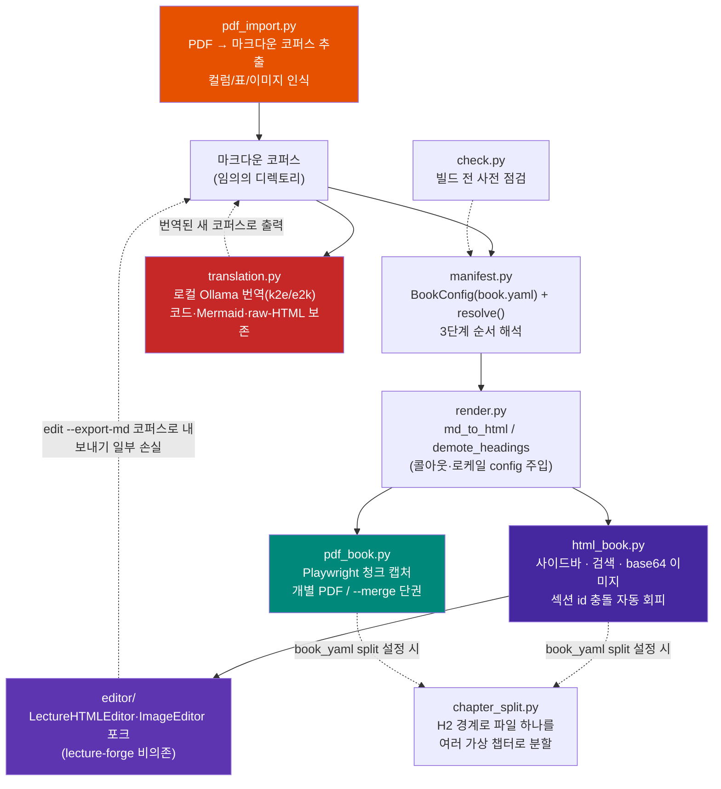

# MDBook-binder

[](https://pypi.org/project/mdbook-binder/)
[](LICENSE)

**임의의 마크다운 코퍼스를 검색 가능한 단일 HTML 도서와 PDF(단권/병합)로 변환하고,
결과 HTML을 편집하는 범용 애플리케이션.**

---

## 목차

- [1. 프로젝트 개요](#1-프로젝트-개요)
  - [무엇인가](#무엇인가)
  - [아키텍처](#아키텍처)
  - [설계 원칙](#설계-원칙)
  - [파일 구조](#파일-구조)
- [2. 핵심 기능 및 사용법](#2-핵심-기능-및-사용법)
  - [순서 해석 — 3단계 우선순위](#순서-해석--3단계-우선순위)
  - [book.yaml 설정](#bookyaml-설정)
  - [마크다운 저작 규칙](#마크다운-저작-규칙)
  - [AI로 챕터 저작하기 — Skill/프롬프트 활용](#ai로-챕터-저작하기--skill프롬프트-활용)
  - [빌드 전 사전 점검 — check](#빌드-전-사전-점검--check)
  - [HTML 도서 빌드](#html-도서-빌드)
  - [PDF 빌드 — 개별/병합](#pdf-빌드--개별병합)
  - [HTML 편집](#html-편집)
  - [PDF 임포트 — import](#pdf-임포트--import)
  - [import 결과물을 챕터별로 분리하기 — 사이드바 챕터 링크 만들기](#import-결과물을-챕터별로-분리하기--사이드바-챕터-링크-만들기)
  - [로컬 LLM 번역 — translate](#로컬-llm-번역--translate)
  - [번역 완전성 검증 — 청크 자동 재시도](#번역-완전성-검증--청크-자동-재시도)
- [3. 설치 가이드](#3-설치-가이드)
- [알려진 한계](#알려진-한계)
- [변경이력](#변경이력)
- [라이선스](#라이선스)

---

## 1. 프로젝트 개요

### 무엇인가

MDBook-binder는 **마크다운 파일 모음(코퍼스)을 입력받아, 코드 수정 없이
다음 세 가지를 만드는 CLI 애플리케이션**이다.

1. **검색 가능한 단일 HTML 도서** — 사이드바 목차·전문 검색, 이미지는
   base64 인라인 임베드. Mermaid는 가능하면 빌드 시점에 SVG로 사전
   렌더링한다(오프라인 제약은 [알려진 한계](#알려진-한계) 참고).
2. **PDF 도서** — 챕터별 개별 PDF 또는 병합(merge) PDF.
3. **HTML 도서 편집기** — 브라우저에서 섹션 단위로 마크다운·이미지 편집.

코퍼스가 없다면 영문 PDF로 시작할 수 있다: `import`로 마크다운 코퍼스를
추출하고 `translate`로 로컬 Ollama LLM으로 토큰 비용 없이 번역한 뒤, 위
세 명령으로 이어받는다([PDF 임포트](#pdf-임포트--import),
[번역](#로컬-llm-번역--translate) 참고).

순서·제목·콜아웃 마커는 `book.yaml`이 있으면 그대로 따르고, 없으면
파일명 규칙이나 자연정렬로 자동 추론한다 — 새 파일을 추가해도 코드나
설정을 건드릴 필요가 없다.

### 아키텍처



`html_book.py`가 출력하는 `<section class="chapter-section" id="{slug}">`
구조는 `editor/`가 의존하는 **유일한 불변 계약**이다 — 이 마크업만
유지하면 편집기가 항상 섹션을 인식한다.

### 설계 원칙

1. **순서 해석은 3단계 우선순위**로 자동 결정된다.
   1. 명시적 `book.yaml`(`order.manifest` 또는 `order.files`)
   2. 루트에 ` ```toc ` 펜스 매니페스트가 있으면 자동 채택
   3. `Part_<로마숫자>_.../Chapter_<NN>_...` 명명 규칙 감지
   4. 위 전부 실패 시 디렉토리 전체를 자연정렬(natural sort) — 파일
      누락을 없애는 최종 폴백
2. **책마다 다른 값은 전부 `book.yaml`로 외부화**한다 — `render.py`는
   어떤 코퍼스에도 수정 없이 동작해야 한다.
3. **섹션 ID는 H1/파일명 slug로 자동 생성**되고, 충돌 시 `-2`/`-3`을
   붙인다. 수작업 매핑은 선택적 오버라이드일 뿐이다.
4. **편집기는 lecture-forge에 비의존** — `Lecture_forge`의
   `LectureHTMLEditor`/`ImageEditor`를 포크하되 강의 특화 기능은
   제외했다.

### 파일 구조

```
MDBook-binder/
├── pyproject.toml
├── LICENSE
├── README.md
├── src/mdbook_binder/
│   ├── manifest.py           # BookConfig(book.yaml) + resolve()/resolve_verbose()/resolve_split_targets()
│   ├── chapter_split.py      # book.yaml split 설정 시 H2 경계로 파일 하나를 여러 가상 챕터로 분할
│   ├── render.py             # md_to_html / demote_headings / 콜아웃·로케일
│   ├── html_book.py          # HTML 도서 빌더 (사이드바/검색/base64 이미지/가상 분할)
│   ├── imgembed.py           # 이미지 → base64 data URI 인코딩 공용 유틸
│   ├── mermaid_prerender.py  # Mermaid 빌드 타임 정적 SVG 사전 렌더링 (Playwright)
│   ├── mermaid_wrap.py       # Mermaid 노드/엣지 라벨 자동 줄바꿈
│   ├── theme.py              # --color 색상 테마 프리셋 (사이드바/제목 강조색)
│   ├── pdf_book.py           # PDF 빌더 (청크 캡처 + 개별/병합)
│   ├── pdf_import.py         # PDF → 마크다운 코퍼스 추출 (컬럼/표/이미지 인식)
│   ├── translation.py        # 로컬 Ollama 번역 (청크 분할, 코드/mermaid 보존)
│   ├── check.py              # 빌드 전 사전 점검
│   ├── cli.py                # mdbook-binder CLI (check/build/edit/import/translate)
│   ├── editor/                # Lecture_forge 포크 — lecture-forge 비의존
│   │   ├── html_editor.py      # BookHTMLEditor — 섹션 CRUD, 이미지 추가(base64 임베드), 마크다운 코퍼스 역방향 내보내기
│   │   ├── image_editor.py     # 이미지/다이어그램 편집, 이미지 교체(base64 임베드)
│   │   └── server.py           # Flask 편집 API 서버
│   └── templates/
│       ├── html_book.css/js    # HTML 도서 사이드바·검색·mermaid
│       ├── pdf_override.css    # PDF 전용 레이아웃 오버라이드(CSS)
│       ├── pdf_book.js         # PDF 렌더링 보정(Mermaid 크기 측정·청크 분할)
│       ├── vendor/              # 번들: mermaid.min.js·Noto Sans KR 폰트·Tailwind·EasyMDE·Font Awesome·marked.js(오프라인용)
│       └── editor/              # 편집 SPA (index.html/editor.css/editor.js)
└── tests/
    ├── test_cli.py               # CLI 옵션 배선·에러 메시지 (17건)
    ├── test_manifest.py          # 3단계 순서 해석 + split 설정 파싱/해석 + dedupe_suffix (25건)
    ├── test_chapter_split.py     # H2 경계 탐지·분할(펜스/raw HTML/blockquote 보호) (9건)
    ├── test_html_book.py         # 섹션 id 충돌 회피·이미지 임베드·챕터 간 링크 재작성·가상 분할 (18건)
    ├── test_check.py             # 사전 점검 + 설치 환경 점검 (14건)
    ├── test_editor.py            # 이미지 추가/교체 + 코퍼스 역방향 내보내기 + 저장 왕복 충실도(위치·죽은 링크 포함) (20건)
    ├── test_imgembed.py          # base64 data URI 인코딩(MIME 판정) (3건)
    ├── test_mermaid_prerender.py # Mermaid 사전 렌더링 성공/폴백 (6건)
    ├── test_mermaid_wrap.py      # 라벨 자동 줄바꿈 (12건)
    ├── test_theme.py             # 색상 테마 프리셋 + book.yaml/--color 연동 (8건)
    ├── test_pdf_book.py          # PDF 페이지 경계 계산 + 상호참조·누락 이미지 처리 (32건)
    ├── test_pdf_import.py        # 컬럼/표/불릿/이미지 추출 + 헤딩 감지 + 코드 블록 감지 (104건)
    ├── test_render.py            # md_to_html 블록 보호·콜아웃·표 렌더링 (13건)
    ├── test_translation.py       # 청크 분할·블록 보호·k2e/e2k 검증·재시도·resume (95건)
    └── test_server.py            # 웹 에디터 Flask API (12건)
```

---

## 2. 핵심 기능 및 사용법

### 순서 해석 — 3단계 우선순위

명령은 코퍼스와 무관하게 동일하다(`mdbook-binder build html <root>`) —
코퍼스가 가진 정보에 따라 우선순위가 자동 선택된다.

```bash
# book.yaml도 매니페스트도 명명 규칙도 없는 새 폴더
mdbook-binder build html ~/Docs/my-notes
# → 3순위(자연정렬) 자동 적용, 파일 누락 없음
```

### book.yaml 설정

코퍼스 루트에 선택적으로 둔다 — 없어도 기본값/자동 감지로 동작한다.

```yaml
title: "실전 AI 에이전트 하네스 엔지니어링"
author: "Sungwoo Kim"
language: ko                # ko/en — 검색 UI 로케일

order:                       # 1순위 — 있으면 이걸로 순서 확정
  files: [00_서문.md, Part_I_.../Chapter_01_*.md, ...]
  # 또는: manifest: 01_목차.md ( ```toc 펜스 매니페스트 파일 지정 )

exclude:                     # 챕터가 아닌 문서 제외 (glob 패턴)
  - "README.md"
  - "IMAGES.md"

callouts:
  tip_markers: ["👨‍💻", "📋", "📊", "🔧", "🚨", "💡"]   # 없으면 전부 blockquote로 렌더

section_id_overrides:        # 파일 stem → 원하는 URL slug (선택)
  "Chapter_01_서론": "intro"

custom_css: custom.css       # 코퍼스 루트 기준 상대 경로 (선택)
                              # raw-HTML(@@HTML_START@@) 다이어그램이 쓰는
                              # 커스텀 클래스는 여기 지정한 CSS로 HTML/PDF
                              # 빌드 양쪽에 그대로 얹는다.

color: green                 # 사이드바/제목 강조색 테마 (선택, 기본 purple)
                              # purple/blue/green/teal/red/orange/gray 중 하나.
                              # CLI --color가 이 값보다 우선한다.

split:                       # 단일 파일을 빌드 시점에 여러 사이드바 섹션으로
  files: [My_Book.md]        # 분할한다(소스는 그대로). 자세한 건 "import
  heading_level: 2            # 결과물을 챕터별로 분리하기" 참고.
```

### 마크다운 저작 규칙

빌드 엔진이 코퍼스를 올바르게 해석하려면 챕터 마크다운이 아래 규칙을
지켜야 한다.

- **각 챕터 파일은 H1(`# 제목`) 하나로 시작해야 한다.** 첫 H1이 섹션
  제목·URL slug(`#section-id`)·PDF 표지 제목으로 추출된다. 없으면
  파일명 stem이 대신 쓰여 slug가 지저분해진다. 하위 제목은 H2 이하로 —
  전체 도서로 합쳐질 때 모든 헤딩이 한 단계씩 강등된다(H1→H2, H2→H3…).
- **이미지 경로는 해당 마크다운 파일 기준 상대 경로**로 쓴다
  (`` 등). `http(s)://`, `data:`, `file://`, `#`는
  그대로 통과된다. 누락된 이미지는 빌드를 막지 않고 끝에 목록만
  출력한다 — `check`로 미리 확인한다.
- **Mermaid 다이어그램은 ` ```mermaid ` 펜스 블록**으로 작성한다.
- **코퍼스 전용 raw HTML(커스텀 다이어그램 등)은 `@@HTML_START@@`/
  `@@HTML_END@@` 블록**으로 감싼다. 그 안의 커스텀 CSS 클래스는
  범용 템플릿에 없으므로 `book.yaml`의 `custom_css`로 선언한다.
- **콜아웃(TIP박스)은 blockquote 맨 앞을 `callouts.tip_markers`에
  등록한 이모지로 시작**해야 인식된다. 등록하지 않으면 일반 인용문으로
  렌더된다.
- **blockquote 안 코드블록은 각 줄 앞에 `> `를 붙인
  ` > ``` ` ~ ` > ``` ` 형태**로 쓴다.
- **관리용 문서(집필 가이드 등)는 기본적으로 빌드에 포함된다** — 기본
  제외 대상은 `book.yaml`/`README.md`뿐이다. 그 외는 `exclude` 패턴으로
  직접 제외한다.
- **순서 자동 인식은 `Part_<로마숫자>_.../Chapter_<NN>_...` 명명**을
  따른다. 앞자리 `00_`류(서문)는 파트 앞, `50` 이상(맺음말류)은 뒤에
  자동 배치되고 `Appendix/`는 항상 마지막이다. 따르지 않으면
  `order.files`로 순서를 직접 명시하거나 3순위(자연정렬)로 폴백된다.
- **URL slug를 직접 고정하려면 `section_id_overrides`**로 파일 stem →
  slug를 지정한다. 없으면 H1 제목에서 자동 생성되고, 제목이 같아도
  `-2`/`-3`으로 충돌을 자동 회피한다.

### AI로 챕터 저작하기 — Skill/프롬프트 활용

AI에게 챕터 초안을 맡기면 위 [마크다운 저작 규칙](#마크다운-저작-규칙)을
모른 채로 써서 `check`/빌드 시점에야 문제가 드러나기 쉽다.

**Claude Code — Skill 설치.** 이 저장소의
[`.claude/skills/mdbook-authoring/SKILL.md`](.claude/skills/mdbook-authoring/SKILL.md)를
그대로 복사해 아래 위치 중 하나에 붙여넣는다. 저장 위치에 따라 적용
범위가 갈린다(README에 내용을 다시 옮기지 않는 이유는 두 사본이
어긋나지 않게 하기 위해서다 — 최신 규칙은 항상 그 파일이 정본이다):

| 저장 위치 | 적용 범위 |
|---|---|
| `<코퍼스_루트>/.claude/skills/mdbook-authoring/SKILL.md` | 그 코퍼스에서만 동작. git으로 커밋하면 팀과 공유 가능 |
| `~/.claude/skills/mdbook-authoring/SKILL.md` | 이 컴퓨터에서 Claude Code로 여는 **모든** 코퍼스에 항상 적용 |

```bash
mkdir -p .claude/skills/mdbook-authoring        # 코퍼스 하나에만 적용
mkdir -p ~/.claude/skills/mdbook-authoring      # 이 컴퓨터의 모든 코퍼스에 적용
```

설치는 **새로 여는 Claude Code 세션부터** 반영된다. 이후 "챕터 써줘"처럼
스킬 설명과 맞아떨어지는 요청 시 자동으로 로드되거나,
`/mdbook-authoring`으로 직접 호출할 수 있다.

**다른 AI 도구(ChatGPT/Cursor 등) — 범용 프롬프트 블록.** 파일을 참조할
수 없으므로 규칙 본문을 프롬프트에 직접 넣는다(요약본 — 상세 근거는 위
SKILL.md 참고).

```text
당신은 mdbook-binder로 빌드될 마크다운 챕터를 작성합니다. 다음 규칙을 반드시
지키세요.
1. 파일은 H1(`# 제목`) 하나로 시작한다. 하위 제목은 H2 이하로 쓴다.
2. 이미지 경로는 해당 마크다운 파일 기준 상대 경로로 쓴다.
3. Mermaid 다이어그램은 `mermaid` 코드 펜스 블록으로 작성한다.
4. 커스텀 raw HTML은 @@HTML_START@@ / @@HTML_END@@ 블록으로 감싼다.
5. 콜아웃(TIP박스)은 book.yaml의 callouts.tip_markers에 등록된 이모지로
   blockquote를 시작한다(등록 안 된 이모지는 일반 인용문으로 렌더됨).
6. blockquote 안에 코드블록을 넣으려면 각 줄 앞에 `> `를 붙인다(일반
   코드 펜스를 그대로 넣지 않는다).
7. 챕터가 아닌 관리용 .md를 추가하면 book.yaml의 exclude 패턴에 등록한다.
8. 순서 자동 인식을 받으려면 Part_<로마숫자>_.../Chapter_<NN>_... 명명
   규칙을 따르거나, book.yaml의 order.files로 순서를 직접 명시한다.

작성 후에는 mdbook-binder check <root>로 검증하세요.
```

### 빌드 전 사전 점검 — check

HTML을 렌더링하지 않고 원본 마크다운만 훑어 빠르게 확인한다 — 챕터가
아닌 문서 혼입이나 챕터 미발견(잘못된 `ROOT` 등, 이대로 빌드하면 즉시
실패)을 빌드 후가 아니라 미리 발견한다. PDF 빌드·웹 에디터 등 선택
기능(extras) 설치 상태도 함께 점검한다.

```bash
mdbook-binder check ~/Docs/my-book
```

`ROOT`(마크다운 코퍼스 루트 디렉토리) 외 별도 옵션은 없다.

```
순서 해석: 2순위: Part/Chapter 명명 규칙 감지
챕터 수: 44개

[Part I]
  - Part_I_기초/Chapter_01_...md
  ...

⚠️  같은 제목을 쓰는 챕터 1건 (빌드 시 id에 -2, -3... 자동 부여됨):
   - "개요": Part_I_.../Chapter_01_x.md, Part_II_.../Chapter_01_y.md

[선택 기능(extras) 설치 상태]
  ⚠️  Mermaid 사전 렌더링 · PDF 빌드 (Playwright Chromium) — 미설치
      → python -m playwright install chromium
  ✅ PDF 병합 (pypdf)
  ✅ PDF 임포트 컬럼/표 인식 (pdfplumber)
  ✅ 웹 에디터 (Flask)
  ✅ 이미지 처리 (Pillow)
  ⚠️  번역 (Ollama) — 미설치
      → pip install "mdbook-binder[translate]"
```

### HTML 도서 빌드

```bash
mdbook-binder build html <코퍼스_루트> [--out out.html] [--title ...] [--language ko|en] [--color NAME]
```

**옵션**

| 옵션 | 설명 | 기본값 |
|---|---|---|
| `ROOT` (필수) | 마크다운 코퍼스 루트 디렉토리 | — |
| `--out PATH` | 출력 HTML 경로 | `ROOT/<제목을 슬러그화한 이름>.html` |
| `--title TEXT` | 도서 제목 오버라이드 | `book.yaml`의 `title`, 없으면 `ROOT` 디렉토리 이름 |
| `--language TEXT` | UI 로케일 오버라이드. `ko`/`en`만 준비돼 있어 그 외 값은 UI 문구가 `ko`로 폴백하지만 `<html lang>`엔 입력값이 그대로 쓰인다 | `book.yaml`의 `language`, 없으면 `ko` |
| `--color [blue\|gray\|green\|orange\|purple\|red\|teal]` | 사이드바/제목 강조색 테마 | `book.yaml`의 `color`, 없으면 `purple` |

**동작**

- 이미지를 base64 data URI로 인라인 임베드 — 파일 하나로 완전히
  독립적으로 열린다.
- Mermaid는 Playwright/Chromium이 설치돼 있으면(`[pdf]` extra) 빌드
  시점에 SVG로 사전 렌더링한다 — 없으면 열람 시 CDN `mermaid.js`로
  폴백한다(코드 하이라이트·웹폰트는 여전히 CDN 의존적 —
  [알려진 한계](#알려진-한계) 참고).
- 인페이지 전문 검색(하이라이트·이전/다음 이동), 사이드바 목차 자동 생성.
- 다른 Part의 챕터 제목이 우연히 같아도(예: "개요") 섹션 id 충돌을
  자동으로 회피한다.
- 빌드 끝에 누락된 이미지 참조를 모아 요약 출력한다.

### PDF 빌드 — 개별/병합

```bash
mdbook-binder build pdf <코퍼스_루트>                        # 챕터별 개별 A4 PDF
mdbook-binder build pdf <코퍼스_루트> --merge [이름]          # 단권으로 병합
mdbook-binder build pdf <코퍼스_루트> --out-dir <디렉토리>     # 출력 위치 지정
mdbook-binder build pdf <코퍼스_루트> --color green           # 색상 테마 지정(HTML과 동일한 프리셋)
mdbook-binder build pdf <코퍼스_루트> --merge --title "..." --language en  # 병합본 제목/언어 지정
```

각 챕터를 Playwright/Chromium으로 독립 렌더링한다. 긴 Mermaid
다이어그램은 청크 단위로 스크린샷 캡처해 삽입해 페이지 경계에서 잘리는
문제를 피한다. 다이어그램은 페이지 폭을 넘을 때만 축소해, CSS가 강제로
확대하거나 앞뒤로 빈 페이지가 생기는 문제를 막는다. 병합도 각 챕터를
동일한 코드 경로로 렌더링한 뒤 pypdf로 PDF 객체 레벨에서 합쳐, 개별·
병합 생성의 폰트 크기·다이어그램 해상도가 항상 동일하다. 병합본에는
챕터별 북마크가 자동으로 붙고, Part가 있으면 Part 제목 아래 챕터들이
중첩된 아웃라인으로 구성된다. `--title`(기본: `book.yaml`의
`title`/디렉토리명)은 병합본의 PDF 문서 메타데이터 제목에만 반영된다 —
개별 모드는 챕터마다 자기 h1 제목을 쓰므로 영향받지 않는다.
`--language`(기본: `book.yaml`의 `language` 또는 `ko`)는 모든 페이지의
`<html lang>` 속성에 반영된다.

### HTML 편집

```bash
mdbook-binder edit <html_경로> [--port 5757] [--out edited.html] [--no-browser] [--export-md <디렉토리>]
```

브라우저에서 섹션 단위로 마크다운 편집(EasyMDE), 이미지/다이어그램
목록·삭제·교체, 이미지 업로드/갤러리를 제공한다. `<section id="{slug}">`
구조에만 의존하므로 어떤 코퍼스로 만든 HTML이든 동일하게 동작한다.

`--export-md <디렉토리>`를 주면 저장할 때마다 HTML뿐 아니라 편집 결과를
챕터별 `.md` + `images/` + `book.yaml`로도 내보낸다(코퍼스 역반영).
완전한 역방향 변환은 아니다 — [알려진 한계](#알려진-한계)에 정리된
Mermaid 원본 소스·콜아웃 마커·챕터 간 상대경로 링크는 빌드 시점에 이미
사라져 있어 복원되지 않는다.

### PDF 임포트 — import

```bash
mdbook-binder import <PDF_경로> <출력_디렉토리> [--title TEXT] [--no-images] [--no-headings]
```

`pip install "mdbook-binder[pdf]"`(pdfplumber/pypdf/pillow)가 필요하다.
PDF만 지원한다 — `.pdf`가 아니면 바로 에러로 안내한다. docx 등은
워드프로세서로 PDF 변환 후 넣는다(별도 포맷별 변환기를 두지 않은
의도적 설계).

**옵션**

| 옵션 | 설명 | 기본값 |
|---|---|---|
| `PDF_PATH` (필수) | 추출할 PDF 경로 | — |
| `OUT_DIR` (필수) | 마크다운 코퍼스를 생성할 디렉토리 | — |
| `--title TEXT` | 제목/파일명 오버라이드 | PDF 파일명 |
| `--no-images` | 이미지 추출 없이 텍스트만 뽑는다 | 이미지 추출함 |
| `--no-headings` | 폰트 크기 기반 챕터 제목 자동 감지를 끈다 | 감지함 |

**동작**

- pdfplumber로 단어별 좌표를 읽어 다단(2단 이상) 레이아웃을 컬럼별로
  위→아래 순서로 재조립하고, 표처럼 정렬된 줄은 마크다운 표로
  재구성한다.
- 고정폭 폰트(Courier/Consolas 등) 줄이 2줄 이상 연속되면 ` ``` ` 펜스로
  감싼다. 들여쓰기는 복원하지 못한다(단어를 공백 하나로 이어붙이는
  추출 방식의 한계) — 코드 내용은 보존되지만 포맷은 손으로 다듬어야
  할 수 있다.
- 문서마다 다른 불릿 글리프·단어 간격을 표본 조사해 자동 보정한다.
- 페이지 여백에 홀로 있는, 쪽번호로 추정되는 숫자를 위치 기반으로
  제거한다.
- 이미지는 `OUT_DIR/images/`에 저장하고 본문 흐름의 원래 위치에
  끼워 넣는다(`--no-images`로 끌 수 있음) — 작은 장식용 이미지와
  반복되는 로고/아이콘은 자동 제외.
- **챕터 제목 후보를 폰트 크기로 자동 감지한다.** 본문 폰트 크기의
  최빈값보다 눈에 띄게(기본 1.15배 이상) 크면서도 드물게 등장하는
  짧고 고립된 줄을 제목으로 보고 `## `를 붙인다. 감지 비율이
  비정상적으로 높으면(전체 줄의 5% 초과) 자동으로 무효화된다. 하나라도
  감지되면 `book.yaml`에 `split` 설정을 자동으로 써서 [가상
  분할](#import-결과물을-챕터별로-분리하기--사이드바-챕터-링크-만들기)이
  추가 조치 없이 적용된다. 휴리스틱이라 부정확할 수 있다 —
  `--no-headings`로 끄거나 `.md`의 `## ` 마커를 직접 손으로 고친다.
- 전체 PDF를 파일 하나로 추출한다 — Part_/Chapter_ 명명 규칙에 맞춘
  실제 파일 자동 분할은 지원하지 않는다. 결과는 그 자체로 `build
  html`/`build pdf`/`translate`가 바로 받는 유효한 코퍼스다.
- 텍스트 레이어가 없는 스캔 PDF는 지원하지 않는다 — OCR 기능은 없다.

### import 결과물을 챕터별로 분리하기 — 사이드바 챕터 링크 만들기

`import`는 PDF 전체를 단일 마크다운 파일 하나로 추출한다(Part_/
Chapter_ 명명 규칙에 맞춘 실제 파일 자동 분할은 미지원). 사이드바는
기본적으로 파일 하나당 하나씩 생기지만, `import`가 [폰트 크기로 챕터
제목을 자동 감지](#pdf-임포트--import)해 `book.yaml`에 `split` 설정을
함께 쓰므로 대부분 추가 조치 없이 챕터별로 나뉜다. 감지가 부정확하면
아래 방법으로 직접 고친다.

**1. `book.yaml`의 `split` — 파일은 그대로, 빌드 시점에만 쪼갠다(권장)**

```yaml
split:
  files: [My_Book.md]   # order.files와 동일한 glob 문법
  heading_level: 2         # 기본값 2(= "## "). 생략 가능
```

소스를 건드리지 않고 지정 헤딩 레벨(기본 H2) 경계마다 섹션을 나눈다 —
`build html`은 사이드바 링크로, `build pdf`는 개별 모드에서 조각마다
별도 PDF(충돌 시 `-2`/`-3` 자동 부여), 병합 모드에서 조각마다 별도
북마크를 만든다. H2는 각 조각의 H1로 자동 승격되고, 펜스 코드·
`@@HTML_START@@` raw HTML·blockquote 코드펜스 안의 `## `는 경계로
오인하지 않는다. 해당 레벨 헤딩이 없으면 조용히 기존 동작(파일 1개 =
섹션 1개)으로 폴백한다. 단, 상호참조 링크는(HTML 빌드에서만 해당 —
PDF는 챕터 간 링크 재작성을 하지 않는다) 첫 조각으로만 연결된다 —
특정 하위 챕터로 바로 연결하려면 2번처럼 실제 파일을 쪼갠다.

**2. 마크다운 직접 편집 — 실제 파일을 쪼개고 싶을 때**

`import`가 만든 `.md`를 원래 장/절 헤딩 경계마다 잘라 별도 파일로
저장한다(각 파일은 H1 하나로 시작 — 원래 H2를 H1로 올린다).
`Part_I_.../Chapter_01_제목.md` 명명 규칙을 따르면 순서가 자동
인식되고, 아니면 `order.files`로 직접 나열한다. 이미지는 같은
디렉토리에 있으면 그대로 유효하다. `check`로 확인한 뒤 `build html`로
다시 빌드한다.

**3. `edit` 웹 에디터 — 기존 챕터를 다듬는 용도, 새 챕터 생성은 불가**

`edit`는 빌드된 HTML의 기존 섹션만 다룬다. 섹션을 새로 만드는 기능은
없으므로, 분할은 반드시 1번 또는 2번으로 빌드 이전에 끝낸다.

### 로컬 LLM 번역 — translate

```bash
mdbook-binder translate <코퍼스_루트> <출력_디렉토리> --direction k2e|e2k [--model ...] [--check-only] [--resume]
```

`pip install "mdbook-binder[translate]"`(ollama 클라이언트)와 로컬에서
실행 중인 [Ollama](https://ollama.com) 서버·모델이 필요하다. 로컬
실행이므로 API 토큰 비용은 없다.

**옵션**

| 옵션 | 설명 | 기본값 |
|---|---|---|
| `ROOT` (필수) | 번역할 마크다운 코퍼스 루트 | — |
| `OUT_DIR` (필수) | 번역 결과를 미러링할 디렉토리 | — |
| `--direction [k2e\|e2k]` (필수) | `k2e`: 한→영, `e2k`: 영→한 | — |
| `--model TEXT` | Ollama 모델명 | `book.yaml`의 `translation.model`, 없으면 `exaone3.5:7.8b` |
| `--host TEXT` | Ollama 서버 주소 | `book.yaml`의 `translation.host`, 없으면 `http://localhost:11434` |
| `--timeout INTEGER` | 청크 1건당 번역 타임아웃(초) | `book.yaml`의 `translation.timeout`, 없으면 300 |
| `--chunk-chars INTEGER` | 청크 최대 글자수 | `book.yaml`의 `translation.chunk_chars`, 없으면 2000 |
| `--temperature FLOAT` | Ollama 샘플링 temperature | `book.yaml`의 `translation.temperature`, 없으면 0.2 |
| `--num-ctx INTEGER` | Ollama 컨텍스트 창 크기(토큰) | `book.yaml`의 `translation.num_ctx`, 없으면 8192 |
| `--check-only` | 실제 번역 없이 Ollama 연결·모델 설치 상태만 확인 | — |
| `--resume` | `OUT_DIR`에 이미 있는 챕터는 건너뜀(미완료 마커가 있으면 실패했던 청크만 자동 재번역) | 끔(항상 재번역) |

**동작**

- `build`와 동일한 3단계 순서 해석으로 챕터를 걷어 번역하고, `OUT_DIR`에
  동일한 디렉토리 구조로 미러링한다(`exclude` 규칙도 그대로 적용).
- 코드·Mermaid·raw-HTML 블록은 번역하지 않고 원문 그대로 보존한다.
- **마크다운 표는 행의 셀 단위로 번역한다** — 표 전체를 한 번에 넘기면
  로컬 소형 모델이 뒤쪽 행을 빠뜨리거나 파이프(`|`) 구조를 깨는 사례가
  실사용에서 반복 확인됐다. 구분선 행과, 번역할 원본 언어 문자가 없는
  셀(k2e는 한글, e2k는 영문 없음)은 모델을 거치지 않는다.
- **청크마다 번역 완전성을 자동 검증하고 필요하면 재시도한다**(k2e·e2k
  둘 다) — 자세한 동작은 [번역 완전성
  검증](#번역-완전성-검증--청크-자동-재시도) 참고.
- `book.yaml`의 `language`를 번역 방향에 맞춰(`k2e`→`en`, `e2k`→`ko`)
  다시 써서 출력한다.
- 청크 하나에도 수십 초가 걸릴 수 있어 챕터·청크 단위 진행 상황을
  출력한다(`📄 [2/12] Chapter_02.md`, `청크 1/3 번역 중...`).
- 모델이 없어도 자동으로 pull하지 않는다 — `ollama pull <모델>`을 직접
  실행해야 한다. `--check-only`로 번역 전에 연결·모델 상태만 먼저
  확인할 수 있다.
- **`--resume`으로 중단 후 이어할 수 있다** — `OUT_DIR`에 이미 결과
  파일이 있는 챕터는 건너뛴다. 재시도 후에도 청크가 미완료였던
  챕터(k2e는 한글 잔존, e2k는 원문 그대로 에코된 청크)는
  `<파일명>.incomplete.json` 마커가 남아 "이미 있음"으로 건너뛰지
  않고, 실패했던 청크만 다시 번역한다(청크 단위 이어하기 — 이미 통과한
  청크는 다시 묻지 않는다). `--resume`을 반복할수록(LLM 출력이
  비결정적이므로) 미완료 청크 수가 점차 줄어드는 방향으로 수렴한다.

`book.yaml`에 기본값을 지정해둘 수도 있다(CLI 옵션이 이 값보다
우선한다):

```yaml
translation:
  model: exaone3.5:7.8b
  host: http://localhost:11434
  timeout: 300
  chunk_chars: 2000
  temperature: 0.2
  num_ctx: 8192
```

### 번역 완전성 검증 — 청크 자동 재시도

> ⚠️ **로컬 소형 모델은 가끔 청크를 통째로 미번역 상태로 돌려준다.**
> 실사용 코퍼스에서 챕터 전체의 최대 16%가 한글로 남는 형태로
> 확인됐다.

방향마다 청크 검증 신호가 다르다 — 같은 잣대를 양쪽에 쓸 수 없기
때문이다.

**`k2e`(한→영)**: 청크 하나를 번역할 때마다 결과에 **한글이 5% 넘게
남아있으면 그 청크를 최대 2회 재시도**한다. 성공적으로 번역된 청크도
고유명사·약어 한두 개는 한글로 남을 수 있으므로, 임계값은 "0%"가
아니라 "사실상 미번역"으로 볼 수 있는 지점으로 잡았다.

**`e2k`(영→한)**: 대칭인 "영문 비율" 검증은 쓸 수 없다 — 한국어 기술
문서엔 영문 고유명사·약어가 정상적으로 섞이는 게 흔해 번역 실패와
정상 잔존을 구분할 신호가 없다. 대신 **원문과 결과가 완전히 동일한
청크**(라틴 문자 20자 이상)를 "번역 시도조차 안 함"으로 보고 최대
2회 재시도한다. 짧은 청크(20자 미만)는 원래도 안 바뀌는 게 정상이라
오탐하지 않는다.

**재시도 후에도 실패하면**: 조용히 통과시키지 않고 콘솔에 경고를
출력한다.

```
📄 [1/5] Chapter_01_배경과_근거.md
  청크 1/8 번역 중...
  청크 2/8 번역 중...
  ...
  ⚠️  재시도 후에도 한글이 남은 청크: [3, 5] — 수동 확인 필요
...
⚠️  총 1개 챕터에 재시도 후에도 번역되지 않은 청크가 있습니다:
   - Chapter_01_배경과_근거.md (청크 [3, 5])
   해당 구간을 직접 열어 확인하거나, translate를 다시 실행해보세요
   (로컬 LLM 출력은 비결정적이라 재실행 시 통과하는 경우가 있습니다).
```

빌드 전체를 막지는 않는다 — 어떤 챕터의 어떤 청크를 확인해야 하는지
요약만 알려준다.

**검증은 번역 실행 중에만 동작하고, 결과는 `.incomplete.json` 마커로
`OUT_DIR`에 남는다.** 실패한 청크 번호뿐 아니라 그 시점의 청크별 번역
결과와 청킹에 쓰인 `chunk_chars`도 함께 담는다. 이 마커가 있는 챕터는
이후 `--resume` 실행에서 **실패했던 청크만** 다시 번역하고 나머지는
캐시를 그대로 이어붙인다 — 같은 코퍼스를 `--resume`으로 반복 돌리는
것만으로 미완료 청크가 점차 줄어든다. `--chunk-chars`를 이전 실행과
다르게 주면(청킹 경계가 달라지므로) 캐시를 재사용할 수 없어 챕터
전체를 처음부터 다시 번역한다.

청크별 캐시(`chunks` 필드)는 0.5.4 이후 실행에만 마커에 담긴다 — 그
이전 마커나 마커 자체가 없는 `OUT_DIR`을 만나면 챕터 전체를 처음부터
다시 번역하는 것으로 안전하게 폴백한다.

---

## 3. 설치 가이드

[PyPI](https://pypi.org/project/mdbook-binder/)에 배포돼 있어 `pip
install`로 바로 설치할 수 있다. 아직 릴리스에 포함되지 않은 최신 수정
사항을 쓰려면 저장소를 직접 클론해 설치한다.

### 사전 준비

- **Python 3.11 이상**
- **PDF 빌드(`[pdf]` extra)를 쓸 경우**: Playwright Chromium의 런타임
  공유 라이브러리가 필요하다. `python -m playwright install --with-deps
  chromium` 하나로 브라우저와 OS 의존성을 한 번에 설치하는 것을
  권장한다. `--with-deps`를 못 쓰는 제한된 리눅스 환경이라면 Ubuntu
  22.04/24.04 기준 아래 패키지가 대략 필요하다(버전에 따라 패키지명이
  다를 수 있음):

  ```bash
  sudo apt install -y \
    libnss3 libnspr4 libatk1.0-0 libatk-bridge2.0-0 libcups2 \
    libdrm2 libdbus-1-3 libxcb1 libxkbcommon0 libx11-6 \
    libxcomposite1 libxdamage1 libxext6 libxfixes3 libxrandr2 \
    libgbm1 libpango-1.0-0 libcairo2 libasound2
  ```

  macOS는 `playwright install chromium`만으로 충분하다.

### 설치 — PyPI (권장)

```bash
pip install mdbook-binder                          # 코어만 — HTML 빌드/check/편집(수동 조합)
pip install "mdbook-binder[pdf]"                    # + Playwright/pypdf/pdfplumber (PDF 빌드·임포트용)
pip install "mdbook-binder[editor]"                 # + Flask/Pillow (웹 편집기용)
pip install "mdbook-binder[translate]"              # + ollama 클라이언트 (로컬 LLM 번역용)
pip install "mdbook-binder[pdf,editor,translate]"   # 전체 기능

python -m playwright install --with-deps chromium   # [pdf] 설치 시 1회
```

`[translate]`는 `ollama` 파이썬 클라이언트만 추가한다 — Ollama 서버
자체와 번역에 쓸 모델(기본값 `exaone3.5:7.8b`)은 별도로 설치해야 한다
([ollama.com](https://ollama.com), `ollama pull <모델명>`). 로컬 실행이라
API 토큰 비용은 없다.

### 설치 — 저장소 클론 (개발/최신 미배포 수정 사항)

```bash
git clone https://github.com/bullpeng72/MDBook-binder.git
cd MDBook-binder
python3 -m venv .venv && source .venv/bin/activate

pip install -e .                            # 코어만 — HTML 빌드/check/편집(수동 조합)
pip install -e ".[pdf]"                     # + Playwright/pypdf/pdfplumber (PDF 빌드·임포트용)
pip install -e ".[editor]"                  # + Flask/Pillow (웹 편집기용)
pip install -e ".[translate]"               # + ollama 클라이언트 (로컬 LLM 번역용)
pip install -e ".[dev]"                     # + pytest/ruff (개발용)
pip install -e ".[pdf,editor,translate,dev]"  # 전체 기능

python -m playwright install --with-deps chromium   # [pdf] 설치 시 1회
```

### 빠른 시작

```bash
mdbook-binder check ~/Docs/my-book                 # 1. 빌드 전 사전 점검 + 설치 환경 점검
mdbook-binder build html ~/Docs/my-book --out out.html   # 2. HTML 도서 빌드
mdbook-binder edit out.html                        # 3. 브라우저에서 편집
mdbook-binder build pdf ~/Docs/my-book --merge      # 4. (선택) 단권 PDF
```

코퍼스가 아직 없고 영문 PDF만 있다면(로컬 LLM 번역, 토큰 비용 없음,
기본 모델 `exaone3.5:7.8b`):

```bash
mdbook-binder import ~/book.pdf ~/corpus-en
mdbook-binder translate ~/corpus-en ~/corpus-ko --direction e2k
mdbook-binder build html ~/corpus-ko
```

### 개발

```bash
pip install -e ".[dev,pdf,editor,translate]"
pytest tests/ -q      # 388개 테스트 (cli 17 + manifest 25 + chapter_split 9 + html_book 18 + check 14 + editor 20 + imgembed 3 + mermaid_prerender 6 + mermaid_wrap 12 + theme 8 + pdf_book 32 + pdf_import 104 + render 13 + translation 95 + server 12)
ruff check src tests
```

---

## 알려진 한계

- **완전 오프라인은 이미지·Mermaid까지만이다**: 이미지는 항상 인라인
  임베드되고 Mermaid는 Playwright가 있으면 빌드 시점에 SVG로 사전
  렌더링된다(없으면 CDN 폴백). 코드 하이라이트·웹폰트는 아직 CDN
  의존적 — 차단 환경에서도 내용은 읽히지만 스타일만 빠진다.
- **패키지 설치 용량이 크다(~6MB)**: Mermaid·에디터가 오프라인에서도
  동작하도록 관련 JS/CSS/폰트를 번들했다 — `pip install` 용량에만
  영향, 생성되는 HTML 크기와는 무관하다.
- **부분 빌드 미지원**: 항상 코퍼스 전체를 대상으로 한다.
- **마크다운 스캐폴딩 미포함**: 이 도구는 빌드/편집만 담당한다.
- **`Part_<로마숫자>_...` 명명 규칙 감지는 `Appendix/`만 특별
  취급**한다 — 그 외 디렉토리는 자연정렬만 적용되므로, 필요하면
  `book.yaml`의 `order.files`로 순서를 직접 명시한다.
- **`pdf_book.py`/`editor/`의 실제 Playwright 렌더링(`convert_one`)은
  자동 테스트가 없다** — 순수 함수·API 로직은 테스트로 고정돼 있지만
  브라우저 렌더링 자체는 수동 검증만 거쳤다.
- **`edit --export-md`는 완전한 역방향 변환이 아니다**: 사전
  렌더링된 Mermaid는 SVG 이미지로만 남고(렌더링 실패분은 원본 그대로
  복원됨), 콜아웃 마커 문자열과 챕터 간 상호참조 링크(`#앵커`로
  재작성된 것)는 원래 형태로 복원되지 않는다.
- **`build pdf`는 챕터 간 상호참조 링크를 연결하지 않는다**: 각
  챕터를 별개로 렌더링한 뒤 병합하는 구조라 다른 챕터의 앵커 대상이
  존재하지 않는다 — 죽은 `.md` 링크로 남기는 대신 텍스트만 남기고
  링크는 없앤다.
- **`import`는 Part_/Chapter_ 파일 자동 분할을 지원하지 않는다**:
  PDF 전체를 파일 하나로 추출하고, 대신 폰트 크기로 챕터 제목을
  감지해 `split` 설정을 자동으로 붙인다(휴리스틱이라 부정확할 수
  있음 — [직접
  분리하기](#import-결과물을-챕터별로-분리하기--사이드바-챕터-링크-만들기)
  참고). 스캔 PDF(OCR 없음), 복잡한 다단 표, 코드 블록의 들여쓰기·
  굵게/기울임도 지원하지 않는다.
- **`translate`는 로컬 Ollama 서버가 필수다**: 원격/클라우드 LLM
  API는 지원하지 않는다.
- **최신 변경이력이 PyPI에는 아직 반영되지 않았을 수 있다**: 가장
  최근 [변경이력](#변경이력)이 필요하면 저장소를 직접 클론해 설치한다.

---

## 변경이력

### 0.5.6 (2026-08-22) — e2k 표 번역 방향 버그 + edit/build/import 버그 10건

- **fix**: e2k(영→한) 표 셀이 전혀 번역되지 않던 버그(셀 스킵 판정이
  방향과 반대로 걸려있었음) — k2e와 동일한 청크 검증·재시도·`--resume`
  이어하기도 e2k에 추가(원문과 결과가 동일한 청크를 실패로 판정)
- **fix**: `edit`에서 이미지가 no-op 저장에도 사라지던 버그(가장 심각),
  다이어그램·콜아웃 위치가 저장마다 끝으로 밀리던 문제, 섹션 삭제 시
  다른 챕터에 남는 죽은 상호참조 링크, 동일 이미지가 여럿일 때
  삭제/교체 요청이 조용히 무시되던 문제
- **fix**: `import`가 표 셀의 `|` 미이스케이프로 열이 어긋나던 문제,
  페이지 넘는 표의 헤더 행이 러닝 헤더로 오인돼 지워지던 문제
- **fix**: `build`에서 blockquote 안 Mermaid가 깨지던 문제, `build pdf`가
  챕터 간 상호참조를 죽은 링크로 남기고 누락 이미지를 경고 없이
  렌더링하던 문제
- 🧹 **techdebt**: 파일명 중복 방지 로직을 `manifest.dedupe_suffix()`로
  통합, `imgembed.py` 직접 테스트 신설
- 회귀 테스트 60건 추가(총 388개)

### 0.5.5 (2026-08-21) — k2e 표 셀 번역 환각 방지

- **fix**: 짧은 표 셀·문단 번역 시 모델이 원문 대신 가짜 마크다운 예시를
  지어내 표 구조가 깨지던 문제 수정 — 프롬프트를 금지형으로 바꾸고, 셀
  결과에 개행·과도한 길이가 보이면 재시도 후 원문 보존으로 폴백
- 회귀 테스트 8건 추가(총 328개)

### 0.5.4 (2026-08-21) — 표 셀 단위 번역 + Ollama 옵션 조정 + 청크 단위 --resume

- **fix**: 표 청크를 통째로 번역하면 뒤쪽 행이 빠지거나 파이프 구조가
  깨지던 문제 — 표는 셀 단위로 번역하고 파이프 구조는 코드가 보존
- **feat**: `--temperature`/`--num-ctx` 옵션 추가(기본값 0.2 / 8192)
- **feat**: `--resume`이 실패한 청크만 재번역(청크별 캐시를
  `.incomplete.json`에 저장)
- 회귀 테스트 22건 추가(총 320개)

### 0.5.3 (2026-08-20) — translate --resume 미완료 청크 자동 재번역

- **feat**: k2e 재시도 후에도 한글이 남은 챕터에 `.incomplete.json` 마커
  생성, `--resume`이 이를 감지해 자동 재번역
- 회귀 테스트 4건 추가(총 298개)

### 0.5.2 (2026-08-19) — PDF 임포트 코드 블록 감지 + 사전 점검·타입 정리

- **feat**: 고정폭 폰트로 조판된 줄을 감지해 코드 펜스로 자동 변환
- **fix**: `build html --out` 상위 디렉토리 자동 생성, `check`의 빈
  코퍼스 오탐, pdfminer 경고 노이즈 억제
- 🧹 **techdebt**: bs4 관련 mypy 타입 오류 22건 정리
- 회귀 테스트 16건 추가(총 294개)

### 0.5.1 (2026-08-14) — 편집기 툴바 아이콘 폰트 누락 패키징 버그 수정

- **fix**: 패키지 데이터 글롭 누락으로 Font Awesome 웹폰트가 wheel/sdist
  빌드에서 빠져 `edit` 편집기 아이콘이 빈 사각형으로 보이던 문제 수정

### 0.5.0 (2026-08-14) — edit 역방향 저장 + PDF 파이프라인 불일치 수정

- **feat**: `edit --export-md` 역방향 내보내기, `build pdf --title`/
  `--language`, `translate --resume` 추가
- **fix**: 헤딩 자동 감지 오탐 대폭 감소(4,244개 → 112개), `split` 설정
  미적용, 챕터마다 빈 페이지 추가되던 문제, `edit` 저장 왕복 손실(링크·
  콜아웃·목록·코드 언어 태그) 수정
- 회귀 테스트 21건 추가(총 278개)

### 0.4.2 (2026-08-14) — 단일 파일 코퍼스도 챕터별 사이드바로

- **feat**: `split` 설정(H2 경계 가상 챕터 분리) + 챕터 제목 자동 감지
- 회귀 테스트 38건 추가(총 257개)

### 0.4.1 (2026-08-13) — Breaking: `import pdf` → `import`

- **breaking**: `import pdf` → `import` 평탄화
- **feat**: `translate` k2e 잔여 한글 검증·자동 재시도(최대 2회)
- 회귀 테스트 24건 추가(총 219개)

### 0.4.0 (2026-08-13)

- **feat**: `import`(PDF 임포트), `translate`(로컬 Ollama 번역) 명령 추가
- **fix**: Ollama 모델명 매칭, 도움말 줄바꿈, 순번 오인식, 웹 에디터
  CDN 의존 제거
- 회귀 테스트 111건 추가(총 195개)

### 0.3.7 (2026-08-05)

- **fix**: 굵은 글씨 안 링크 색상 불일치 수정

### 0.3.6 (2026-08-05)

- **feat**: 챕터 간 상대경로 링크 `#앵커` 자동 재작성(NFC/NFD 정규화 포함)
- 회귀 테스트 4건 추가(총 84개)

### 0.3.5 (2026-08-02)

- **fix**: `playwright` 버전 상한 추가(Chromium 리비전 불일치 오탐 수정)

### 0.3.4 (2026-08-02)

- **feat**: `check` 선택 기능 설치 상태 점검 강화
- **fix**: 예외 메시지 줄바꿈 깨짐 수정
- 회귀 테스트 10건 추가(총 80개)

### 0.3.3 (2026-08-02)

- **fix**: 파일명 NFC/NFD 정규화, 웹 편집기 이미지 서빙 경로 화이트리스트
  우회 수정
- **feat**: 병합 PDF 챕터별 북마크(Part 중첩) 추가
- CLI 도움말 현행화, 회귀 테스트 33건 추가(총 70개)

### 0.3.2 (2026-07-28)

- **fix**: 세로형 Mermaid PDF 페이지 경계 계산 오차 수정

### 0.3.1 (2026-07-28)

- **feat**: `--color` 사이드바/제목 강조색 테마 옵션 추가(7종)
- **fix**: Mermaid 서브그래프·라벨 줄바꿈, 편집기 미리보기 폰트 불일치
- 회귀 테스트 13건 추가(총 37개)

### 0.3.0 (2026-07-27)

- **feat**: Mermaid 빌드 시점 SVG 사전 렌더링 + 라벨 자동 줄바꿈
- **fix**: 한글 라벨 줄바꿈·CDN 로드 실패 대응 등 렌더링 버그 다수 수정
- 회귀 테스트 7건 추가(총 24개)

### 0.2.0 (2026-07-27)

- **feat**: `--version` 옵션 추가
- **fix**: 버전/패키지명 불일치 수정

### 0.1.0 (2026-07-26)

- **rename**: `book-binder` → `mdbook-binder`
- 초기 구현(마크다운 코퍼스 → HTML/PDF 변환·편집) 및 패키징·렌더링 안정화

---

## 라이선스

MIT — [LICENSE](LICENSE) 참고.
