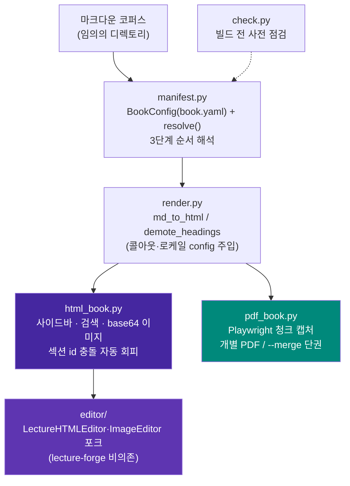

# MDBook-binder

[](https://pypi.org/project/mdbook-binder/)
[](LICENSE)

**임의의 마크다운 코퍼스를 검색 가능한 단일 HTML 도서와 PDF(단권/병합)로 변환하고,
결과 HTML을 편집하는 범용 애플리케이션.**

---

## 목차

- [1. 프로젝트 개요](#1-프로젝트-개요)
  - [무엇인가](#무엇인가)
  - [아키텍처](#아키텍처)
  - [설계 원칙](#설계-원칙)
  - [파일 구조](#파일-구조)
- [2. 핵심 기능 및 사용법](#2-핵심-기능-및-사용법)
  - [순서 해석 — 3단계 우선순위](#순서-해석--3단계-우선순위)
  - [book.yaml 설정](#bookyaml-설정)
  - [마크다운 저작 규칙](#마크다운-저작-규칙)
  - [AI로 챕터 저작하기 — Skill/프롬프트 활용](#ai로-챕터-저작하기--skill프롬프트-활용)
  - [빌드 전 사전 점검 — check](#빌드-전-사전-점검--check)
  - [HTML 도서 빌드](#html-도서-빌드)
  - [PDF 빌드 — 개별/병합](#pdf-빌드--개별병합)
  - [HTML 편집](#html-편집)
- [3. 설치 가이드](#3-설치-가이드)
- [알려진 한계](#알려진-한계)
- [변경이력](#변경이력)
- [라이선스](#라이선스)

---

## 1. 프로젝트 개요

### 무엇인가

MDBook-binder는 **임의의 마크다운 파일 모음(코퍼스)을 입력으로 받아, 코드
수정 없이 다음 세 가지를 만들어내는 독립 실행형 CLI 애플리케이션**이다.

1. **검색 가능한 단일 HTML 도서** — 사이드바 목차, 인페이지 전문 검색을
   갖추고, 이미지는 base64로 인라인 임베드되어 파일 하나만으로 열린다.
   Mermaid 다이어그램도 가능하면 빌드 시점에 정적 SVG로 사전 렌더링해
   같이 임베드한다(오프라인 제약은 [알려진 한계](#알려진-한계) 참고).
2. **PDF 도서** — 챕터별 개별 PDF 또는 한 권으로 병합(merge)한 PDF.
3. **HTML 도서 편집기** — 생성된 HTML 도서를 브라우저에서 섹션 단위로 다시
   열어 마크다운·이미지를 편집할 수 있는 웹 편집기.

코퍼스가 `book.yaml`로 순서·제목·콜아웃 마커 등을 명시하면 그대로 따르고,
없으면 파일/디렉토리 명명 규칙이나 디렉토리 트리 자연정렬로 순서를 자동
추론한다 — 그래서 새 마크다운 파일이 추가되어도 코드나 설정을 건드릴 필요가
없다.

### 아키텍처



`html_book.py`가 출력하는 `<section class="chapter-section" id="{slug}">`
구조는 `editor/`가 의존하는 **유일한 불변 계약**이다 — 다른 무엇을 바꾸더라도
이 마크업 계약은 유지해야 편집기가 섹션을 인식한다.

### 설계 원칙

1. **순서 해석은 3단계 우선순위**로 자동 결정된다 — 코드 수정 없이 새
   마크다운 파일이 반영되도록 하는 것이 핵심 목표다.
   1. 명시적 `book.yaml`(`order.manifest` 또는 `order.files`)
   2. `book.yaml`이 없어도 루트에 ` ```toc ` 펜스 매니페스트가 있으면 자동
      채택
   3. `Part_<로마숫자>_.../Chapter_<NN>_...` 명명 규칙 감지
   4. 위 전부 실패 시 디렉토리 트리 전체를 자연정렬(natural sort)해 전부
      포함 — "새 파일이 조용히 누락되는 일"을 구조적으로 없애는 최종 폴백
2. **책마다 다른 값(제목/저자/언어/제외 패턴/콜아웃 마커/커스텀 CSS)은 전부
   `book.yaml`로 외부화** — 렌더링 엔진(`render.py`) 코드는 어떤 코퍼스에도
   수정 없이 동작해야 한다.
3. **섹션 ID는 기본적으로 H1/파일명 slug 자동 생성**, 충돌 시 자동으로
   `-2`/`-3` 접미사를 붙인다 — 수작업 매핑 테이블은 "예쁜 URL을 원할 때만
   쓰는 선택적 오버라이드"로 격하한다.
4. **편집기는 lecture-forge에 비의존** — `Lecture_forge`의
   `LectureHTMLEditor`/`ImageEditor`를 포크하되 벡터스토어 기반 이미지 추천
   등 강의 특화 기능은 제외했다.

### 파일 구조

```
MDBook-binder/
├── pyproject.toml
├── LICENSE
├── README.md
├── src/mdbook_binder/
│   ├── manifest.py           # BookConfig(book.yaml) + resolve()/resolve_verbose()
│   ├── render.py             # md_to_html / demote_headings / 콜아웃·로케일
│   ├── html_book.py          # HTML 도서 빌더 (사이드바/검색/base64 이미지)
│   ├── imgembed.py           # 이미지 → base64 data URI 인코딩 공용 유틸
│   ├── mermaid_prerender.py  # Mermaid 빌드 타임 정적 SVG 사전 렌더링 (Playwright)
│   ├── mermaid_wrap.py       # Mermaid 노드/엣지 라벨 자동 줄바꿈
│   ├── theme.py              # --color 색상 테마 프리셋 (사이드바/제목 강조색)
│   ├── pdf_book.py           # PDF 빌더 (청크 캡처 + 개별/병합)
│   ├── check.py              # 빌드 전 사전 점검
│   ├── cli.py                # mdbook-binder CLI (check/build html/build pdf/edit)
│   ├── editor/                # Lecture_forge 포크 — lecture-forge 비의존
│   │   ├── html_editor.py      # BookHTMLEditor — 섹션 CRUD, 이미지 추가(base64 임베드)
│   │   ├── image_editor.py     # 이미지/다이어그램 편집, 이미지 교체(base64 임베드)
│   │   └── server.py           # Flask 편집 API 서버
│   └── templates/
│       ├── html_book.css/js    # HTML 도서 사이드바·검색·mermaid
│       ├── pdf_override.css    # PDF 전용 레이아웃 오버라이드(CSS)
│       ├── pdf_book.js         # PDF 렌더링 보정(Mermaid 크기 측정·청크 분할)
│       ├── vendor/              # 번들된 mermaid.min.js + Noto Sans KR 폰트(오프라인 렌더링용)
│       └── editor/              # 편집 SPA (index.html/editor.css/editor.js)
└── tests/
    ├── test_manifest.py          # 3단계 순서 해석 (7건)
    ├── test_html_book.py         # 섹션 id 충돌 회피·이미지 임베드·챕터 간 링크 재작성 (7건)
    ├── test_check.py             # 사전 점검 + 설치 환경 점검 (10건)
    ├── test_editor.py            # 이미지 추가/교체 후 base64 임베드 (2건)
    ├── test_mermaid_prerender.py # Mermaid 사전 렌더링 성공/폴백 (6건)
    ├── test_mermaid_wrap.py      # 라벨 자동 줄바꿈 (12건)
    ├── test_theme.py             # 색상 테마 프리셋 + book.yaml/--color 연동 (8건)
    ├── test_pdf_book.py          # PDF 페이지 경계 계산 순수 함수 (20건)
    └── test_server.py            # 웹 에디터 Flask API (12건)
```

---

## 2. 핵심 기능 및 사용법

### 순서 해석 — 3단계 우선순위

명령은 코퍼스가 무엇이든 동일하다(`mdbook-binder build html <root>`) — 코퍼스가
이미 가진 정보(매니페스트/명명 규칙)에 따라 내부적으로 다른 우선순위가 자동
선택된다.

```bash
# book.yaml도, 매니페스트도, Part/Chapter 명명 규칙도 없는 새 폴더
mdbook-binder build html ~/Docs/my-notes
# → 3순위(자연정렬)가 자동 적용, 최소한 파일이 빠지는 일은 없다
```

### book.yaml 설정

코퍼스 루트에 선택적으로 둔다 — 없어도 전부 기본값/자동 감지로 동작한다.

```yaml
title: "실전 AI 에이전트 하네스 엔지니어링"
author: "Sungwoo Kim"
language: ko                # ko/en — 검색 UI 문자열 로케일

order:                       # 1순위 — 있으면 이걸로 순서 확정
  files: [00_서문.md, Part_I_.../Chapter_01_*.md, ...]
  # 또는: manifest: 01_목차.md  ( ```toc 펜스 매니페스트 파일 지정 )

exclude:                     # 챕터가 아닌 문서 제외 (glob 패턴)
  - "README.md"
  - "IMAGES.md"

callouts:
  tip_markers: ["👨‍💻", "📋", "📊", "🔧", "🚨", "💡"]   # 없으면 전부 blockquote로 렌더

section_id_overrides:        # 파일 stem → 원하는 URL slug (선택)
  "Chapter_01_서론": "intro"

custom_css: custom.css       # 코퍼스 루트 기준 상대 경로 (선택)
                              # 코퍼스별 raw-HTML 다이어그램(@@HTML_START@@ 블록)이
                              # 쓰는 커스텀 클래스는 범용 템플릿에 넣을 수 없으므로,
                              # 여기 지정한 CSS 파일 내용을 HTML/PDF 빌드 모두에 그대로 얹는다.

color: green                 # 사이드바/제목 강조색 테마 (선택, 기본 purple)
                              # purple/blue/green/teal/red/orange/gray 중 하나.
                              # CLI --color를 주면 이 값보다 우선한다.
```

### 마크다운 저작 규칙

빌드 엔진이 코퍼스를 올바르게 해석하려면 챕터 마크다운이 아래 규칙을
지켜야 한다.

- **각 챕터 파일은 H1(`# 제목`) 하나로 시작해야 한다.** 첫 H1이 섹션 제목·
  URL slug(`#section-id`)·PDF 표지 제목으로 추출된다. H1이 없으면 파일명
  stem이 대신 쓰여 slug가 지저분해진다. 문서 안에 H1은 하나만 두고, 하위
  제목은 H2 이하로 쓴다 — 전체 도서로 합쳐질 때 모든 헤딩이 자동으로 한
  단계씩 강등되므로(H1→H2, H2→H3…) 챕터 내부 구조는 그대로 유지된다.
- **이미지 경로는 해당 마크다운 파일 기준 상대 경로**로 쓴다
  (`` 등). `http(s)://`, `data:`, `file://`, `#`로
  시작하는 경로는 그대로 통과된다. 참조된 파일이 실제로 없으면 빌드는
  멈추지 않고 빌드 끝에 누락 목록만 모아 출력한다 — 오타를 늦게 발견하지
  않으려면 `check` 명령으로 미리 확인한다.
- **Mermaid 다이어그램은 ` ```mermaid ` 펜스 블록**으로 작성한다.
- **코퍼스 전용 raw HTML(커스텀 다이어그램 등)은 `@@HTML_START@@` /
  `@@HTML_END@@` 블록**으로 감싼다. 그 안에서 쓰는 커스텀 CSS 클래스는
  범용 템플릿에 없으므로 `book.yaml`의 `custom_css`로 별도 선언해야 한다.
- **콜아웃(TIP박스)은 blockquote 맨 앞을 `book.yaml`의
  `callouts.tip_markers`에 등록한 이모지로 시작**해야 인식된다. 등록하지
  않으면 모든 blockquote는 그냥 일반 인용문으로 렌더된다.
- **blockquote 안에 코드블록을 넣으려면 각 줄 앞에 `> `를 붙인
  ` > ``` ` ~ ` > ``` ` 형태**로 쓴다.
- **관리용 문서(집필 가이드 등 챕터가 아닌 `.md`)는 기본적으로 빌드에
  포함된다** — 기본 제외 대상은 `book.yaml`/`README.md`뿐이다. 그 외
  파일은 `book.yaml`의 `exclude` 패턴으로 직접 제외해야 한다.
- **순서 자동 인식을 받으려면 파일/디렉토리 명명 규칙을 따른다**:
  `Part_<로마숫자>_.../Chapter_<NN>_...` 구조를 쓰면 2순위 규칙이 파트·
  챕터 순서를 자동으로 잡는다. 최상위 파일 중 앞자리 번호가 `00_`류(서문)는
  파트 챕터들 앞에, `50` 이상(맺음말류)은 뒤에 자동 배치되고,
  `Appendix/` 디렉토리는 항상 맨 마지막에 붙는다. 이 규칙을 따르지 않는
  코퍼스는 `book.yaml`의 `order.files`로 순서를 직접 명시하거나, 그마저
  없으면 3순위(자연정렬 전체 포함)로 폴백된다 — 파일이 조용히 빠지는 일은
  없지만 순서가 기대와 다를 수 있다.
- **URL이 보기 좋은 slug를 원하면 `book.yaml`의 `section_id_overrides`로
  파일 stem → slug를 직접 지정**한다. 지정하지 않으면 H1 제목에서 자동
  생성되며, 서로 다른 챕터의 제목이 같아도 `-2`/`-3` 접미사로 충돌을
  자동 회피한다.

### AI로 챕터 저작하기 — Skill/프롬프트 활용

챕터 초안을 AI에게 맡기면 위 [마크다운 저작 규칙](#마크다운-저작-규칙)을 모르는
채로 써서 `check`/빌드 시점에야 문제가 드러나기 쉽다 — 규칙 자체는 이 README를
정본(single source of truth)으로 유지하고, 사용하는 AI 도구에 맞는 방식으로
그 정본을 참조하게 만드는 두 가지 방법을 쓸 수 있다.

**Claude Code — 얇은 래퍼 Skill.** 규칙을 다시 옮겨 적지 않고 이 절을
가리키기만 하는 스킬을 저장소에 두면, 규칙이 바뀔 때 README 한 곳만 고치면
된다.

```markdown
<!-- .claude/skills/mdbook-authoring/SKILL.md -->
---
name: mdbook-authoring
description: mdbook-binder 코퍼스에 마크다운 챕터를 추가/수정할 때 저작
  규칙(H1 제목, 이미지 상대 경로, Mermaid 펜스, 콜아웃 마커, Part/Chapter
  명명 규칙 등)을 적용한다. "챕터 써줘", "이 코퍼스에 새 문서 추가해줘" 등의
  요청에 사용.
---

이 저장소는 mdbook-binder로 빌드되는 마크다운 코퍼스다. 챕터를 새로 쓰거나
수정하기 전에 README.md의 "마크다운 저작 규칙" 절
(#마크다운-저작-규칙)을 읽고 그대로 따른다 — 규칙 원문은 그 절에만 있으므로
여기서 다시 옮겨 적지 않는다. 작성 후에는 `mdbook-binder check <root>`로
검증한다.
```

**다른 AI 도구(ChatGPT/Cursor 등) — 범용 프롬프트 블록.** Claude Code의
스킬 자동 트리거 없이도 붙여넣기만 하면 되도록, 규칙을 요약한 프롬프트를
그대로 시스템/커스텀 프롬프트에 넣는다.

```text
당신은 mdbook-binder로 빌드될 마크다운 챕터를 작성합니다. 다음 규칙을 반드시
지키세요.
1. 파일은 H1(`# 제목`) 하나로 시작한다. 하위 제목은 H2 이하로 쓴다.
2. 이미지 경로는 해당 마크다운 파일 기준 상대 경로로 쓴다.
3. Mermaid 다이어그램은 `mermaid` 코드 펜스 블록으로 작성한다.
4. 콜아웃(TIP박스)은 book.yaml의 callouts.tip_markers에 등록된 이모지로
   blockquote를 시작한다. 등록되지 않은 이모지는 일반 인용문으로 렌더된다.
5. 커스텀 raw HTML은 @@HTML_START@@ / @@HTML_END@@ 블록으로 감싼다.
6. 순서 자동 인식을 받으려면 Part_<로마숫자>_.../Chapter_<NN>_... 명명
   규칙을 따르거나, book.yaml의 order.files로 순서를 직접 명시한다.
자세한 근거는 프로젝트 README의 "마크다운 저작 규칙" 절을 참고하세요.
```

두 방식 모두 규칙 본문을 복제하지 않는다 — 복제하면 README를 고칠 때마다
스킬/프롬프트도 같이 고쳐야 해서 금방 어긋난다. 스킬은 짧은 안내문(위 예시)
정도만 유지하고, 프롬프트 블록은 배포 시점의 스냅샷이라는 점을 감안해 이
README가 바뀌면 함께 갱신한다.

### 빌드 전 사전 점검 — check

실제로 HTML을 렌더링하지 않고 원본 마크다운만 훑어 빠르게 확인한다 — 챕터가
아닌 문서(예: 집필 가이드 `.md`)가 잘못 포함되는 것을 빌드 후에야 발견하는
일을 줄인다. 이어서 PDF 빌드(Playwright Chromium)·웹 에디터(Flask/Pillow) 등
선택 기능(extras)의 설치 상태도 함께 점검해, 몇 분짜리 빌드를 끝까지 돌리고
나서야 브라우저 엔진 미설치 오류를 보는 대신 미리 설치 명령을 안내받는다.

```bash
mdbook-binder check ~/Docs/my-book
```

`ROOT`(마크다운 코퍼스 루트 디렉토리) 외 별도 옵션은 없다 — 실제로 HTML을
렌더링하지 않고 원본 마크다운만 훑으므로 옵션을 최소화했다.

```
순서 해석: 2순위: Part/Chapter 명명 규칙 감지
챕터 수: 44개

[Part I]
  - Part_I_기초/Chapter_01_...md
  ...

⚠️  같은 제목을 쓰는 챕터 1건 (빌드 시 id에 -2, -3... 자동 부여됨):
   - "개요": Part_I_.../Chapter_01_x.md, Part_II_.../Chapter_01_y.md

[선택 기능(extras) 설치 상태]
  ⚠️  Mermaid 사전 렌더링 · PDF 빌드 (Playwright Chromium) — 미설치
      → python -m playwright install chromium
  ✅ PDF 병합 (pypdf)
  ✅ 웹 에디터 (Flask)
  ✅ 웹 에디터 이미지 처리 (Pillow)
```

### HTML 도서 빌드

```bash
mdbook-binder build html <코퍼스_루트> [--out out.html] [--title ...] [--language ko|en] [--color NAME]
```

**옵션**

| 옵션 | 설명 | 기본값 |
|---|---|---|
| `ROOT` (필수) | 마크다운 코퍼스 루트 디렉토리 | — |
| `--out PATH` | 출력 HTML 경로 | `ROOT/<제목을 슬러그화한 이름>.html` |
| `--title TEXT` | 도서 제목 오버라이드 | `book.yaml`의 `title`, 그것도 없으면 `ROOT` 디렉토리 이름 |
| `--language TEXT` | 검색창 문구 등 UI 로케일 오버라이드. `ko`/`en` 문자열만 준비돼 있어 그 외 값을 주면 UI 문구는 `ko`로 폴백하지만 `<html lang>` 속성에는 입력값이 그대로 쓰인다 | `book.yaml`의 `language`, 그것도 없으면 `ko` |
| `--color [blue\|gray\|green\|orange\|purple\|red\|teal]` | 사이드바/제목 강조색 테마 | `book.yaml`의 `color`, 그것도 없으면 `purple` |

**동작**

- 이미지를 base64 data URI로 인라인 임베드 — 이미지 폴더 없이도 단일 파일로
  완전히 독립적으로 열린다(다른 PC로 옮기거나 이메일 첨부해도 그대로 열림).
- Mermaid 다이어그램은 Playwright/Chromium이 설치돼 있으면(`[pdf]` extra)
  빌드 시점에 정적 SVG로 미리 렌더링해 그대로 삽입한다 — 열람 시 CDN
  mermaid.js가 필요 없어져 완전한 오프라인 단일 파일이 된다. Playwright가
  없으면 조용히 원본 마크업으로 폴백해 기존처럼 열람 시 CDN에서 렌더링한다.
  (코드 하이라이트·웹폰트는 아직 CDN 의존적 — [알려진 한계](#알려진-한계) 참고)
- 인페이지 전문 검색(하이라이트·이전/다음 이동), 사이드바 목차 자동 생성.
- 서로 다른 Part의 챕터 제목이 우연히 같아도(예: "개요") 섹션 id 충돌을
  자동으로 회피한다.
- 빌드 끝에 누락된 이미지 참조를 한 번에 모아 요약 출력한다.

### PDF 빌드 — 개별/병합

```bash
mdbook-binder build pdf <코퍼스_루트>                        # 챕터별 개별 A4 PDF
mdbook-binder build pdf <코퍼스_루트> --merge [이름]          # 단권으로 병합
mdbook-binder build pdf <코퍼스_루트> --out-dir <디렉토리>     # 출력 위치 지정
mdbook-binder build pdf <코퍼스_루트> --color green           # 색상 테마 지정(HTML과 동일한 프리셋)
```

각 챕터를 Playwright/Chromium으로 독립 렌더링한다. 긴 Mermaid 다이어그램은
청크 단위로 스크린샷 캡처해 삽입해 페이지 경계에서 잘리는 문제를 피한다.
다이어그램은 `viewBox`에서 읽은 자연 크기를 기준으로 페이지 폭을 넘을 때만
축소하며, CSS가 강제로 확대해 여러 페이지에 걸쳐 표시되거나 그 앞뒤로 빈
페이지가 삽입되는 문제를 방지한다. 병합도 각 챕터를 동일한 코드 경로로
개별 렌더링한 뒤 pypdf로 PDF 객체 레벨에서 합쳐, 개별 생성과 병합 생성의
폰트 크기·다이어그램 해상도가 항상 동일하다. 병합본에는 챕터별 북마크가
자동으로 붙고, Part가 있는 코퍼스는 Part 제목 아래 챕터들이 중첩된
아웃라인으로 구성돼 PDF 뷰어 사이드바에서 바로 챕터로 이동할 수 있다.

### HTML 편집

```bash
mdbook-binder edit <html_경로> [--port 5757] [--out edited.html] [--no-browser]
```

브라우저에서 섹션 단위로 마크다운 편집(EasyMDE), 이미지/다이어그램 목록·삭제·
교체, 이미지 업로드/갤러리를 제공한다. `<section id="{slug}">` 구조에만
의존하므로 어떤 코퍼스로 만든 HTML이든 동일하게 동작한다.

---

## 3. 설치 가이드

[PyPI](https://pypi.org/project/mdbook-binder/)에 배포돼 있어 `pip install`로
바로 설치할 수 있다. 개발에 참여하거나 아직 릴리스에 포함되지 않은
`Unreleased` 상태의 최신 수정 사항을 먼저 쓰려면 저장소를 직접 클론해
설치한다.

### 사전 준비

- **Python 3.11 이상**
- **PDF 빌드(`[pdf]` extra)를 쓸 경우**: Playwright Chromium의 런타임 공유
  라이브러리가 필요하다. `python -m playwright install --with-deps chromium`
  하나로 브라우저와 OS 의존성을 한 번에 설치하는 것을 권장한다. 리눅스에서
  `--with-deps`를 못 쓰는 제한된 환경이라면 Ubuntu 22.04/24.04 기준 아래
  패키지가 대략 필요하다(버전에 따라 패키지명이 다를 수 있어 참고용):

  ```bash
  sudo apt install -y \
    libnss3 libnspr4 libatk1.0-0 libatk-bridge2.0-0 libcups2 \
    libdrm2 libdbus-1-3 libxcb1 libxkbcommon0 libx11-6 \
    libxcomposite1 libxdamage1 libxext6 libxfixes3 libxrandr2 \
    libgbm1 libpango-1.0-0 libcairo2 libasound2
  ```

  macOS는 별도 시스템 패키지 없이 `playwright install chromium`만으로 충분하다.

### 설치 — PyPI (권장)

```bash
pip install mdbook-binder                # 코어만 — HTML 빌드/check/편집(수동 조합)
pip install "mdbook-binder[pdf]"         # + Playwright/pypdf (PDF 빌드용)
pip install "mdbook-binder[editor]"      # + Flask/Pillow (웹 편집기용)
pip install "mdbook-binder[pdf,editor]"  # 전체 기능

python -m playwright install --with-deps chromium   # [pdf] 설치 시 1회
```

### 설치 — 저장소 클론 (개발/최신 미배포 수정 사항)

```bash
git clone https://github.com/bullpeng72/MDBook-binder.git
cd MDBook-binder
python3 -m venv .venv && source .venv/bin/activate

pip install -e .                    # 코어만 — HTML 빌드/check/편집(수동 조합)
pip install -e ".[pdf]"             # + Playwright/pypdf (PDF 빌드용)
pip install -e ".[editor]"          # + Flask/Pillow (웹 편집기용)
pip install -e ".[dev]"             # + pytest/ruff (개발용)
pip install -e ".[pdf,editor,dev]"  # 전체 기능

python -m playwright install --with-deps chromium   # [pdf] 설치 시 1회
```

### 빠른 시작

```bash
mdbook-binder check ~/Docs/my-book                 # 1. 빌드 전 사전 점검 + 설치 환경 점검
mdbook-binder build html ~/Docs/my-book --out out.html   # 2. HTML 도서 빌드
mdbook-binder edit out.html                        # 3. 브라우저에서 편집
mdbook-binder build pdf ~/Docs/my-book --merge      # 4. (선택) 단권 PDF
```

### 개발

```bash
pip install -e ".[dev,pdf,editor]"
pytest tests/ -q      # 84개 테스트 (manifest 7 + html_book 7 + check 10 + editor 2 + mermaid_prerender 6 + mermaid_wrap 12 + theme 8 + pdf_book 20 + server 12)
ruff check src tests
```

---

## 알려진 한계

- **완전 오프라인은 이미지·Mermaid까지만이다**: 이미지는 항상 base64로
  인라인 임베드되고, Mermaid는 Playwright(`[pdf]` extra)가 있으면 빌드
  시점에 정적 SVG로 임베드된다(없으면 열람 시 CDN `mermaid.js`로 폴백,
  빌드 로그에 안내). 반면 코드 하이라이트(`highlight.js`)와 웹폰트(Google
  Fonts)는 아직 매번 CDN에서 불러온다 — 인터넷이 차단된 환경에서는
  브라우저 기본 폰트/무하이라이트로 대체되지만 내용은 읽을 수 있고, CDN
  로드 실패가 검색·목차 등 나머지 기능에 영향을 주지 않도록 방어적으로
  처리돼 있다.
- **패키지 설치 용량이 크다**: Mermaid를 네트워크 없이도 렌더링하려고
  `mermaid.min.js`(~3.3MB)와 한글 라벨용 `NotoSansKR-Regular.woff2`
  (~2.1MB)를 번들했다(합계 ~5.4MB) — `pip install` 1회 용량에만 영향,
  생성되는 HTML 파일 크기와는 무관하다.
- **부분 빌드 미지원**: 파일/패턴을 지정한 일부 챕터만 빌드하는 기능은
  없다 — 항상 코퍼스 전체를 대상으로 한다.
- **마크다운 스캐폴딩 미포함**: 정형 스텁 생성 없이 저작은 사용자 몫이다
  — 이 도구는 빌드/편집만 담당한다.
- **`Part_<로마숫자>_...` 명명 규칙 감지는 `Appendix/`만 특별 취급**한다.
  그 외 비-Part 디렉토리는 자연정렬로만 잡히므로, 필요하면 `book.yaml`의
  `order.files`로 순서를 직접 명시한다.
- **`pdf_book.py`/`editor/`의 Playwright 구동부는 회귀 테스트가 없다**:
  순수 함수·API·이미지 임베드 로직은 `test_pdf_book.py`/`test_server.py`/
  `test_editor.py`로 고정돼 있지만, 실제 브라우저로 렌더링하는
  `convert_one`은 수동 검증만 거쳤다.
- **최신 변경이력이 PyPI에는 아직 반영되지 않았을 수 있다**: PyPI는
  태그·릴리스된 버전까지만 따라간다 — 가장 최근 [변경이력](#변경이력)
  항목이 필요하면 저장소를 직접 클론해 설치한다.

---

## 변경이력

### 0.3.7 (2026-08-05)

- **fix**: `**[출처](url)**`처럼 굵은 글씨 안에 링크가 중첩되면 `a`의 명시적
  색상이 `strong`의 상속색을 이겨 같은 "강조" 표시인데 색만 갈라져 보이던
  문제 수정 — 굵은 글씨 안 링크는 항상 `strong`의 색을 따르도록 통일.

### 0.3.6 (2026-08-05)

- **feat**: 챕터 간 상대경로 `.md` 링크(`[§5](../Part_I/Chapter_05_*.md)`)를
  빌드 시점에 같은 HTML 안의 `#앵커`로 자동 재작성 — 이전에는 존재하지 않는
  로컬 파일을 가리키는 죽은 링크로 남았다. book.yaml이 제외한 파일이나 외부
  URL은 원본 href를 그대로 둔다. macOS(NFD) 파일명과 마크다운 본문(NFC)의
  정규화 불일치도 고려해 매칭한다.
- 회귀 테스트 4건 추가(총 84개).

### 0.3.5 (2026-08-02)

- **fix**: `playwright` 의존성에 버전 상한 추가(`>=1.62,<1.63`). 상한이 없으면
  pip/pipx가 재설치·업그레이드 때마다 최신 playwright를 골라버리는데, 이때
  요구하는 Chromium 빌드 리비전이 이미 받아둔 것과 어긋나 `check`에서
  "미설치"로 오탐되는 문제가 있었다(특히 pipx는 앱마다 별도 격리 venv를
  써서 더 자주 겪는다).

### 0.3.4 (2026-08-02)

- **feat**: `check` 명령이 PDF 빌드(Playwright)·PDF 병합(pypdf)·웹
  에디터(Flask/Pillow) 등 선택 기능 설치 상태도 점검해 설치 명령을
  미리 안내한다.
- **fix**: 여러 줄짜리 예외 메시지가 경고 문장 중간에 끼어들어 줄바꿈이
  깨지던 문제 수정(Mermaid 사전 렌더링/`book.yaml` 파싱/PDF 변환 실패 시).
- 회귀 테스트 10건 추가(총 80개).

### 0.3.3 (2026-08-02)

- **fix**: 파일명 NFC/NFD 정규화 불일치로 `exclude`/`section_id_overrides`가
  동일 파일을 놓치던 문제, 웹 편집기 이미지 서빙 API의 경로 화이트리스트
  우회 문제 수정.
- **feat**: 병합 PDF에 챕터별 북마크(Part 중첩 아웃라인) 추가.
- CLI `--help` 텍스트 현행화, 회귀 테스트 33건 추가(총 70개).

### 0.3.2 (2026-07-28)

- **fix**: PDF 변환 시 세로형 Mermaid 다이어그램의 페이지 경계 계산 오차로
  생기던 빈 공백 문제 수정 — 실측 기반 청크 분할로 교체.

### 0.3.1 (2026-07-28)

- **feat**: `--color` 사이드바/제목 강조색 테마 옵션 추가(7종).
- **fix**: Mermaid 서브그래프·긴 라벨 줄바꿈, 편집기 미리보기 폰트 불일치
  등 렌더링 버그 수정.
- 회귀 테스트 13건 추가(총 37개).

### 0.3.0 (2026-07-27)

- **feat**: Mermaid 다이어그램 빌드 시점 정적 SVG 사전 렌더링(완전 오프라인
  HTML) + 긴 라벨 자동 줄바꿈.
- **fix**: 한글 라벨 줄바꿈·CDN 로드 실패 대응·편집기 이미지 임베드·PDF
  다이어그램/페이지 렌더링 버그 다수 수정.
- 회귀 테스트 7건 추가(총 24개).

### 0.2.0 (2026-07-27)

- **feat**: `--version` 옵션 추가. **fix**: 버전/패키지명 불일치 수정.

### 0.1.0 (2026-07-26)

- **rename**: `book-binder` → `mdbook-binder`. 초기 구현(마크다운 코퍼스 →
  HTML/PDF 변환·편집) 및 패키징·렌더링 안정화.

---

## 라이선스

MIT — [LICENSE](LICENSE) 참고.
